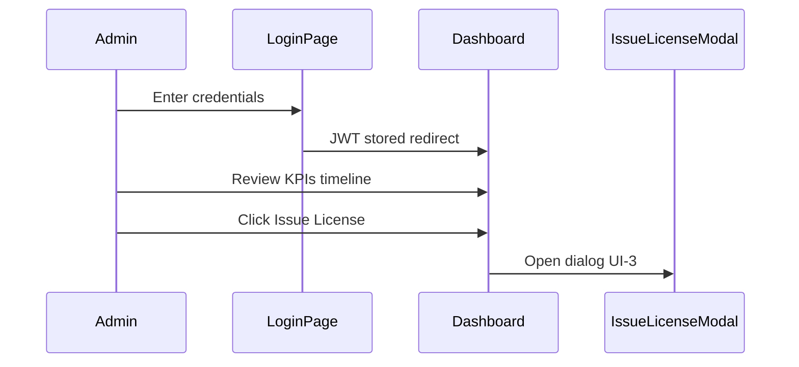

# UI Phase 1 — IA, shell, dashboard

## User story

As the platform admin, I log in, land on the dashboard, see operational KPIs and recent audit activity, and start common tasks (new customer, issue license, integration key) in one click.

## Information architecture

```
Platform Admin
├── Dashboard          /
├── Customers          /customers
├── Service Catalog    /services
├── Licenses           /licenses
├── Audit Log          /audit
├── Validate License   /tools/validate
└── Login              /login  (no drawer)
    └── Integration Keys  /services/{id}/keys  (from catalog drill-down)
```

## Admin shell wireframe

```
+------------------------------------------------------------------------+
| APP BAR  #000000                                                       |
| [≡]  Platform Admin                              [avatar] Logout       |
+----------+-------------------------------------------------------------+
| DRAWER   | MAIN  #000000  padding 24px                                  |
| #0c1408  |                                                             |
|          |  @Body                                                      |
| Dashboard|                                                             |
| Customers|                                                             |
| Services |                                                             |
| Licenses |                                                             |
| Audit    |                                                             |
| Validate |                                                             |
|          |                                                             |
| 240px    |                                                             |
+----------+-------------------------------------------------------------+
```

### Responsive drawer

| Viewport | Behavior |
|----------|----------|
| ≥1200px | Drawer open, mini variant optional |
| 768–1199px | Mini drawer (icons + tooltip) |
| <768px | Closed by default; hamburger opens temporary drawer overlay |

## Dashboard `/` wireframe

```
+------------------------------------------------------------------------+
| H1 Dashboard                                    [optional date filter] |
+------------------------------------------------------------------------+
| METRICS (MudGrid 12-col, gutter 24px)                                  |
| +-------------+ +-------------+ +-------------+ +-------------+        |
| | Total       | | Active      | | Expiring    | | Suspended   |        |
| | Customers   | | Licenses    | | Soon (7d)   | | Items       |        |
| |    42       | |    128      | |     5       | |     3       |        |
| | #71e215 val | |             | | #FFCC00 val | | #f59e0b val |        |
| +-------------+ +-------------+ +-------------+ +-------------+        |
+------------------------------------------------------------------------+
| QUICK ACTIONS                                                          |
| [ + New Customer ]  [ Issue License ]  [ Generate Integration Key ]    |
|   btn-action          btn-action          btn-action                   |
+------------------------------------------------------------------------+
| RECENT ACTIVITY                                                        |
| MudTimeline  (last 10 audit events)                                    |
| ●  LicenseActivated — Acme — HOSTEL — 2 min ago                        |
| ●  CustomerCreated — Beta Corp — 1 hr ago                              |
| ...                                                                    |
|                                    [ View full audit log → ]             |
+------------------------------------------------------------------------+
```

### Metric card spec

| Property | Value |
|----------|-------|
| Component | `MudCard` Class="mud-card-hover-glow pa-4" |
| Background | `#0c1408` |
| Border | `1px solid #333` |
| Border radius | 8px |
| Title | Inter 600, 16px, `#ffffff` |
| Value | Inter 700, 32px, semantic color |
| Subtitle | Inter 400, 14px, `rgba(255,255,255,0.7)` |

### Timeline item spec

| Property | Value |
|----------|-------|
| Dot/line | `#71e215` |
| Primary text | `#FAF5E9`, 14px |
| Timestamp | `rgba(255,255,255,0.6)`, 12px |
| Click | Navigate to `/audit` with filter prefilled (optional) |

## User flow (Mermaid)



## MudBlazor component map (dashboard only)

| UI block | Components |
|--------|------------|
| Shell | `MudLayout`, `MudAppBar`, `MudDrawer`, `MudNavLink`, `MudMainContent` |
| Page title | `MudText` Typo.h4 |
| Metrics | `MudGrid`, `MudItem`, `MudCard`, `MudStack` |
| Quick actions | `MudButton` + `btn-action` class |
| Timeline | `MudTimeline`, `MudTimelineItem` |
| Loading | `MudSkeleton` × 4 cards + timeline |
| Empty timeline | `MudAlert` Severity.Info "No recent activity" |

## Accessibility checklist (dashboard)

- [ ] `#71e215` on `#000000` for values — AAA
- [ ] All icon buttons have `AriaLabel`
- [ ] Quick actions reachable via Tab; Enter activates
- [ ] Focus ring `#FFCC00` visible on cards and buttons
- [ ] Metric values not conveyed by color alone (include text label)
- [ ] Timeline readable at 200% zoom
- [ ] Drawer toggle exposes `aria-expanded`

## Files to add (UI-1 implementation)

```
Client/
  Layout/AdminLayout.razor
  Layout/AdminNavMenu.razor
  Pages/Dashboard.razor
  Theme/PlatformTheme.cs
  wwwroot/css/app.css  (extend)
```

Remove or stop using template `MainLayout.razor` / `NavMenu.razor` for admin routes.
