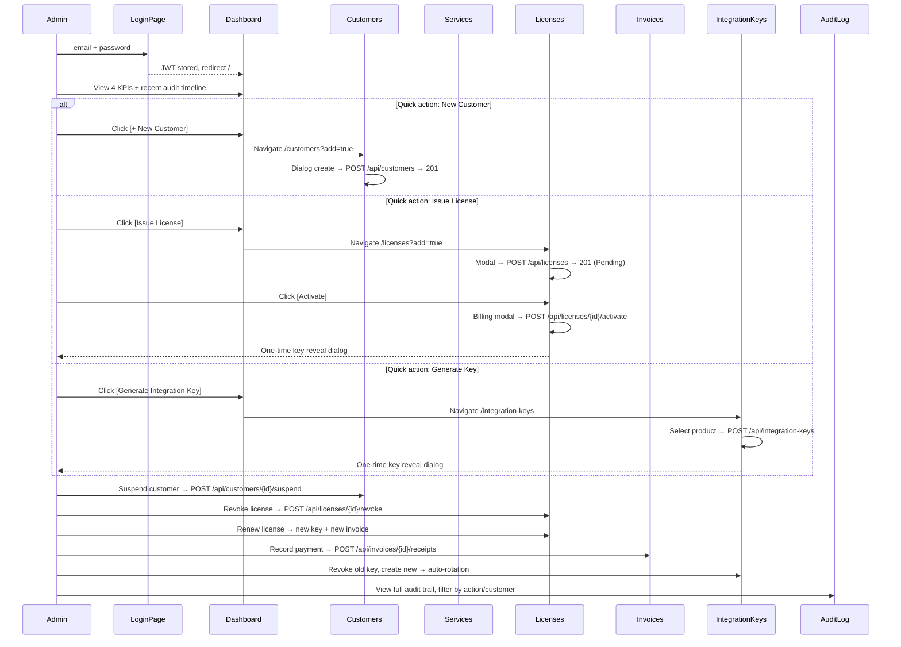

# Wireframes — Platform Admin UI

All screens use [design-system.md](design-system.md) tokens. Mobile-first, responsive across all viewports.

---

## 1. App flow



### Entity relationships

```
Customer ──1:N──> License ──1:N──> AuditLog
                 License ──1:N──> Invoice ──1:N──> Receipt
ServiceProduct ──1:N──> License
ServiceProduct ──1:N──> IntegrationKey   (only 1 active at a time)
Customer ──1:N──> Invoice
```

---

## 2. Information architecture

```
Platform Admin
├── Login                   /login    (no shell — dedicated layout)
├── Dashboard               /
├── Customers               /customers
│   └── (detail drawer: Profile | Licenses | Invoices | Audit)
├── Service Catalog          /services
├── Licenses                /licenses
├── Invoices                /invoices
│   └── /invoices/{id}      (detail page)
├── Integration Keys        /integration-keys
├── Audit Log               /audit
└── Validate License        /tools/validate
```

`/customers/{id}/licenses` is resolved by navigating `/licenses?customerId={id}` — no dedicated page needed.

---

## 3. Responsive system

### Breakpoints

| Token | Width | Role |
|-------|-------|------|
| `xs` | <600px | Default mobile base — all styles start here |
| `sm` | ≥600px | Small tablet — widens layouts, 2-column grids |
| `md` | ≥960px | Desktop — multi-column, DataGrid, inline filters |
| `lg` | ≥1280px | Wide desktop — persistent open drawer |
| `xl` | ≥1920px | Ultra-wide — centered content, outer max-width |

### Typography scale

| Element | xs (default) | sm+ | md+ |
|---------|-------------|-----|-----|
| H1 / page title | 1.375rem (22px) | 1.625rem | 2rem |
| H2 / section heading | 1.125rem (18px) | 1.25rem | 1.5rem |
| Body text | 0.875rem (14px) | — | 1rem |
| KPI value | 1.75rem (28px) | 2rem | 2.5rem |
| Small / caption | 0.75rem (12px) | — | 0.8125rem |
| Code / mono (keys, JSON) | 0.8125rem (13px) | — | — |
| Button text | 0.875rem | — | — |
| Label | 0.8125rem | — | — |

### Component sizing

| Component | xs (<600px) | sm (600–959px) | md+ (≥960px) |
|-----------|------------|----------------|---------------|
| Buttons | Full width, min-height 44px | Auto width, min-height 40px | Auto width |
| KPI cards | Full width, 16px padding | 2 per row, 20px padding | 4 per row, 24px padding |
| Dialogs / modals | Full-screen bottom sheet or 90vw, border-radius 1rem top only | Centered, max-width 480px, border-radius 1rem | Centered, max-width 560px, border-radius 1.25rem |
| Form fields | Full width, stacked | Full width, stacked | Inline pairs where logical |
| Data display | Card list (1 row = 1 card) | Card list or compact table | `MudDataGrid` all columns |
| Filter bar | Collapsed in `MudExpansionPanel` | Expandable, collapsed default | Inline, always visible |
| Page padding | 1rem (16px) | 1.5rem (24px) | 2rem (32px) |
| Grid gutter | 16px | 24px | 24px |
| Snackbar | Full width, bottom | Centered, max-width 400px | Centered, max-width 480px |

### Navigation / Drawer

| Screen | xs (<600px) | sm–md (600–1279px) | lg+ (≥1280px) |
|--------|------------|--------------------|----------------|
| Drawer | Hidden, hamburger opens full-screen overlay | Mini variant (icons+tips), closed by default | Open, persistent mini drawer |
| Drawer width | 280px (overlay) | 64px (mini) | 64px (mini) |
| Active nav | Filled background, `--accent` | Same | Same |
| Inactive nav | `--text-secondary`, hover `--text-primary` | Same | Same |

---

## Form patterns

Every form across all screens follows these rules. Deviate only with explicit reason.

### MudForm + client-side validation

- All forms wrap in `<MudForm @ref="_form" Model="_model" @bind-IsValid="_formValid">`.
- Every input uses `@bind-Value="_model.Field"` + `For="@(() => _model.Field)"` for inline error display.
- Required fields: `Required="true"` on component + `[Required(ErrorMessage = "...")]` on model property.
- Email fields: `[EmailAddress]` annotation + `InputType="InputType.Email"`.
- Numeric fields: `[Range]` or `InputType="InputType.Number"`.
- **Submit button is disabled** until all fields pass validation: `Disabled="@(!_formValid || _busy)"`.
- API call **only proceeds after client-side validation passes**: `await _form.Validate(); if (!_formValid) return;`.
- MudBlazor renders validation errors **inline below each field** automatically via `For` binding.
- Error text color: `--accent`.

### Password fields

Every password field uses a visibility toggle:

```
┌─ Password hidden ────────────────┐  ┌─ Password visible ──────────────┐
│ Password                         │  │ Password                        │
│ ●●●●●●●●●●        [visibility]   │  │ Admin123!       [visibilityOff]  │
└──────────────────────────────────┘  └─────────────────────────────────┘
```

Razor pattern:
```razor
<MudTextField @bind-Value="_model.Password"
              For="@(() => _model.Password)"
              Label="Password"
              Variant="Variant.Outlined"
              InputType="@(_passwordVisible ? InputType.Text : InputType.Password)"
              Adornment="Adornment.End"
              AdornmentIcon="@(_passwordVisible ? Icons.Material.Filled.VisibilityOff
                                                : Icons.Material.Filled.Visibility)"
              OnAdornmentClick="TogglePasswordVisibility"
              FullWidth="true"
              Disabled="_busy" />
```

```csharp
private bool _passwordVisible;
private void TogglePasswordVisibility() => _passwordVisible = !_passwordVisible;
```

### Error display

| Error type | Display |
|-----------|---------|
| Inline field validation | MudBlazor renders below field via `For` — no custom code needed |
| Server API error (400/401/409) | `MudAlert` Severity.Error at top of form, closable, shows server `message` |
| Transient success | `Snackbar.Add("Saved", Severity.Success)` after API success |
| Transient failure | `Snackbar.Add(error, Severity.Error)` |

### Keyboard rules

- Enter key submits the primary form action. `MudTextField` has `OnKeyUp` → check `e.Key == "Enter"` and `!_busy`.
- Tab order follows visual field order (DOM order).
- Focus ring: `2px solid --accent` offset 2px (set globally in `app.css` via `*:focus-visible`).
- Escape closes dialogs (MudBlazor default for `MudDialog`).

### Loading state

- On submit: `_busy = true`, button shows `MudProgressCircular` Size.Small + "Processing..." text.
- All inputs set `Disabled="_busy"`.
- On completion: `_busy = false` in `finally` block.

### Model annotations example

```csharp
private class LoginModel
{
    [Required(ErrorMessage = "Email is required")]
    [EmailAddress(ErrorMessage = "Enter a valid email")]
    public string Email { get; set; } = "";

    [Required(ErrorMessage = "Password is required")]
    [MinLength(8, ErrorMessage = "Password must be at least 8 characters")]
    public string Password { get; set; } = "";
}
```

---

## 4. Shell wireframe

### Desktop (md+, ≥960px)

```
┌──────────────────────────────────────────────────────────────────────────┐
│ APP BAR  var(--bg-base)                                                   │
│ [logo] Platform Admin                                [avatar] Logout     │
├──────┬───────────────────────────────────────────────────────────────────┤
│DRAWER│ MAIN  var(--bg-base)  padding: md+ 2rem / sm 1.5rem / xs 1rem     │
│64px  │                                                                    │
│      │  @Body                                                            │
│ [≡]  │                                                                    │
│ [⏐] │                                                                    │
│ [👤] │                                                                    │
│ [⚙] │                                                                    │
│ [🔑] │                                                                    │
│ [📋] │                                                                    │
│ [📜] │                                                                    │
│ [🔬] │                                                                    │
└──────┴───────────────────────────────────────────────────────────────────┘
```

### Mobile (xs, <600px)

```
┌──────────────────────────────────────────────────┐
│ APP BAR  var(--bg-base)                           │
│ [≡] Platform Admin                   [avatar]    │
├──────────────────────────────────────────────────┤
│ @Body   padding: 1rem                            │
│     (no drawer visible)                          │
│                                                  │
│ ┌─ Hamburger opens drawer overlay ─────────────┐ │
│ │ [≡] Dashboard                                │ │
│ │ [👤] Customers                               │ │
│ │ [⚙] Service Catalog                          │ │
│ │ [🔑] Licenses                                │ │
│ │ [📋] Invoices                                │ │
│ │ [🔗] Integration Keys                        │ │
│ │ [📜] Audit Log                               │ │
│ │ [🔬] Validate License                        │ │
│ │                                              │ │
│ │ ─────────────────────────────────            │ │
│ │ Logout                                       │ │
│ └──────────────────────────────────────────────┘ │
└──────────────────────────────────────────────────┘
```

### Shell component spec

| Element | Component | Spec |
|---------|-----------|------|
| AppBar | `MudAppBar` | `--bg-base`, `--border-subtle` bottom border, Elevation 0 |
| Brand | `MudText` + logo `` | logo 32×32px, title Inter 600 1.125rem `--text-primary` |
| User menu | `MudIconButton` + `MudMenu` | avatar icon, dropdown: Logout |
| Drawer | `MudDrawer` | `--bg-surface`, Variant `Mini` on md+, `Temporary` on xs/sm |
| Nav items | `MudNavLink` | icon + label, Match="Prefix" |
| Nav active | | `--accent` text, 2px left border `--accent` |
| Main content | `MudMainContent` | padding responsive per table above |
| Layout root | `MudLayout` | `--bg-base` background |

---

## 5. Login `/login`

No shell layout — dedicated `LoginLayout` with full-viewport centered card. Follows [Form patterns](#form-patterns).

### Layout states

```
xs (<600px)                    sm (600–959px)               md+ (≥960px)
┌──────────────────┐       ┌────────────────────┐       ┌──────────────────────┐
│ (full height)    │       │                    │       │                      │
│                  │       │  ┌──────────────┐  │       │  ┌────────────────┐  │
│ ┌──────────────┐ │       │  │              │  │       │  │                │  │
│ │              │ │       │  │   [logo]     │  │       │  │    [logo]      │  │
│ │   [logo]     │ │       │  │   7rem       │  │       │  │    8.5rem      │  │
│ │   5.5rem     │ │       │  │              │  │       │  │                │  │
│ │              │ │       │  ├──────────────┤  │       │  ├────────────────┤  │
│ ├──────────────┤ │       │  │ Sign in to   │  │       │  │ Sign in to     │  │
│ │ Sign in to   │ │       │  │ manage...    │  │       │  │ manage         │  │
│ │ manage...    │ │       │  ├──────────────┤  │       │  │ licenses and   │  │
│ ├──────────────┤ │       │  │              │  │       │  │ customers      │  │
│ │              │ │       │  │ Email        │  │       │  ├────────────────┤  │
│ │ Email        │ │       │  │              │  │       │  │                │  │
│ │              │ │       │  │ Password     │  │       │  │ Email          │  │
│ │ Password     │ │       │  │              │  │       │  │                │  │
│ │              │ │       │  │ [Sign in]    │  │       │  │ Password       │  │
│ │ [Sign in]    │ │       │  │              │  │       │  │                │  │
│ │  full width  │ │       │  └──────────────┘  │       │  │ [Sign in]      │  │
│ └──────────────┘ │       │                    │       │  │                │  │
│                  │       │                    │       │  └────────────────┘  │
└──────────────────┘       └────────────────────┘       └──────────────────────┘
  padding: 1rem             padding: 2rem                padding: 3rem
  card: 90vw                card: max 30rem              card: max 30rem
```

### Short viewport fallback (<500px height)
```
┌────────────────────────────────┐
│  [logo] 3rem                   │
│  (subtitle hidden)             │
│  Email | Password | [Sign in]  │
│  padding: 1rem, gap reduced    │
└────────────────────────────────┘
```

### Login component spec

| Element | Component | Spec |
|---------|-----------|------|
| Layout | `LoginLayout` | `--bg-base` + subtle radial gradient (green glow at edges), center content vertically + horizontally |
| Card | `MudPaper` | max-width 30rem, width 100% on xs → capped at 30rem on sm+, glass morphism (`backdrop-filter: blur(24px)`), `--bg-surface` at 85% opacity |
| Card border | | `1px solid` `--accent` at 10% opacity |
| Card shadow | | outer dark shadow + inset subtle highlight |
| Card corners | | border-radius: 1.5rem (xs) → 1.75rem (sm) → 2rem (md+) |
| Card padding | | `pa-5` (1.25rem) xs → `pa-sm-7` (1.75rem) sm → `pa-md-8` (2rem) md+ |
| Logo | `` `login-logo.png` | **4.5rem** (ultra-narrow) → **5.5rem** (xs) → **7rem** (sm) → **8.5rem** (md+) |
| Logo corners | | border-radius: 1.125rem (xs) → 1.25rem (sm) → 1.75rem (md+), subtle green glow shadow |
| Logo shadow | | `0 4px 24px` `--accent` at 15% opacity |
| Subtitle | `MudText` Typo.body2 | "Sign in to manage licenses and customers", `--text-secondary`, centered, 0.875rem |
| Divider | `MudDivider` | subtle, `--accent` at 8% opacity, margin below |
| Email field | `MudTextField` | Outlined variant, full width, label "Email", type email, autocomplete "email" |
| Password field | `MudTextField` | Outlined variant, full width, label "Password", toggle visibility adornment icon |
| Submit button | `MudButton` Variant.Filled | `--accent` background, `--bg-base` text, full width xs → auto width sm+, min-height 3rem, border-radius 0.75rem, font-weight 600 |
| Submit hover | | glow shadow (`0 4px 20px` `--accent` at 25%), translate up 1px |
| Submit loading | | `MudProgressCircular` spinner + "Signing in..." |
| Error alert | `MudAlert` Severity.Error | Outlined, border-radius 0.75rem, closable |
| Animation | CSS keyframe | Slide up + fade in (0.5s), disabled on `prefers-reduced-motion` |
| Accessibility | | Tab order: Email → Password → Sign in. Enter submits. Focus ring `--accent`. All labels readable. |

---

## 6. Dashboard `/`

API: `GET /api/dashboard/stats` → `{ CustomerCount, ActiveLicenses, ExpiringWithin30Days, UnpaidInvoices }`

### Desktop (md+, ≥960px)

```
┌──────────────────────────────────────────────────────────────────────────┐
│ H1 Dashboard                                                             │
├──────────────────────────────────────────────────────────────────────────┤
│ METRICS  4-col grid  gutter 24px                                         │
│ ┌──────────────┐ ┌──────────────┐ ┌──────────────┐ ┌──────────────┐     │
│ │ Customers    │ │ Active       │ │ Expiring in  │ │ Unpaid       │     │
│ │              │ │ Licenses     │ │ 30 Days      │ │ Invoices     │     │
│ │     42       │ │     128      │ │      5       │ │     12       │     │
│ │ --accent     │ │ --accent     │ │ --accent     │ │ --accent     │     │
│ │              │ │              │ │              │ │              │     │
│ │ Tap → /cust  │ │ Tap → /lic   │ │ Tap → /lic?  │ │ Tap → /inv   │     │
│ └──────────────┘ └──────────────┘ └──────────────┘ └──────────────┘     │
├──────────────────────────────────────────────────────────────────────────┤
│ QUICK ACTIONS                                                            │
│ [ + New Customer ]   [ Issue License ]   [ Generate Integration Key ]    │
├──────────────────────────────────────────────────────────────────────────┤
│ RECENT ACTIVITY                                                          │
│ MudTimeline  (last 10 audit events)                                      │
│ ●  LicenseActivated — Acme — HOSTEL — 2 min ago                          │
│ ●  CustomerCreated — Beta Corp — 1 hr ago                                │
│ ...                                                                      │
│                                                       [ View full audit → ]│
└──────────────────────────────────────────────────────────────────────────┘
```

### Mobile (xs, <600px)

```
┌──────────────────────────────────────┐
│ H1 Dashboard                         │
├──────────────────────────────────────┤
│ METRICS  stacked 1-col               │
│ ┌──────────────────────────────────┐ │
│ │ Customers              42       │ │
│ │ Tap to view all          →      │ │
│ └──────────────────────────────────┘ │
│ ┌──────────────────────────────────┐ │
│ │ Active Licenses         128     │ │
│ │ Tap to view all          →      │ │
│ └──────────────────────────────────┘ │
│ ┌──────────────────────────────────┐ │
│ │ Expiring in 30 Days      5      │ │
│ │ Tap to view              →      │ │
│ └──────────────────────────────────┘ │
│ ┌──────────────────────────────────┐ │
│ │ Unpaid Invoices          12     │ │
│ │ Tap to collect payment   →      │ │
│ └──────────────────────────────────┘ │
├──────────────────────────────────────┤
│ QUICK ACTIONS  stacked full width    │
│ [ + New Customer      ]              │
│ [ Issue License       ]              │
│ [ Generate Integ.Key  ]              │
├──────────────────────────────────────┤
│ RECENT ACTIVITY  collapsed list      │
│ ● LicenseActivated — Acme — 2m ago   │
│ ● CustomerCreated — Beta — 1hr ago   │
│ ...                                  │
│         [ View full audit log → ]    │
└──────────────────────────────────────┘
```

### Dashboard component spec

| Element | Component | Spec |
|---------|-----------|------|
| Page title | `MudText` Typo.h4 | "Dashboard", responsive size per typography scale |
| Metrics grid | `MudGrid` | `Spacing="6"` (24px) |
| Metric items | `MudItem` | `xs="12" sm="6" md="3"` |
| Metric card | `MudCard` | `--bg-surface`, `1px solid --border-subtle`, border-radius 8px, padding 16–24px, clickable (navigates), hover glow `--accent` at 10% |
| Metric label | `MudText` Typo.body2 | `--text-secondary`, e.g. "Total Customers" |
| Metric value | `MudText` Typo.h3 | `--accent`, bold 600, responsive size per typography scale |
| Metric subtitle | `MudText` Typo.caption | `--text-secondary`, e.g. "Tap to view all" |
| Quick actions | `MudStack` Row | `xs` stacked full-width, `sm+` row auto-width |
| Action button | `MudButton` Variant.Filled | `--accent` bg, `--bg-base` text, font-weight 600, border-radius 30px, min-height 44px (xs) / 40px (md+) |
| Timeline | `MudTimeline` | last 10 events from `GET /api/audit-logs?limit=10` |
| Timeline dot | | `--accent` |
| Timeline text | `MudText` | primary text `--text-primary` 0.875rem, timestamp `--text-secondary` 0.75rem |
| Timeline empty | `MudAlert` Severity.Info | "No recent activity" |
| View all link | `MudLink` | Navigate `/audit` |
| Loading | `MudSkeleton` | 4 card skeletons + timeline skeleton, `--bg-surface` |

---

## 7. Customers `/customers`

API: `GET /api/customers?page=1&pageSize=25`, `POST`, `PUT`, `POST /suspend`, `POST /reactivate`

### Component spec

| Element | Component | Spec |
|---------|-----------|------|
| Page header | `MudText` H1 + `MudButton` | "Customers" `[+ New Customer]` right-aligned |
| Filters | `MudExpansionPanel` (xs/sm) / inline `MudStack` (md+) | Search text, Status dropdown (All/Active/Suspended), Date range |
| Data | `MudDataGrid<T>` (md+) / card list (xs/sm) | Server-side pagination when API supports it |
| Grid columns | | **Name** (link → drawer), **Contact Email**, **Contact Phone**, **Status** chip, **License Count**, **Created At** (sortable), **Actions** menu |
| Status chip | `MudChip` | **Active**: Filled `--accent`, **Suspended**: Outlined `--accent`, **Text**: `--text-secondary` |
| Row actions menu | `MudIconButton` + `MudMenu` | Edit, View Licenses, Suspend/Activate, Delete |
| Empty state | `MudAlert` + button | "No customers yet" + `[+ New Customer]` CTA |

### Detail drawer (right side)

| Tab | Content |
|-----|---------|
| **Profile** | All customer fields (Name, Email, Phone, InternalNotes) + Edit button |
| **Licenses** | `GET /api/licenses?customerId={id}` — filtered license grid |
| **Invoices** | `GET /api/invoices?customerId={id}` — filtered invoice grid |
| **Audit** | `GET /api/audit-logs?customerId={id}` — filtered audit entries |

### Row actions

| Action | UX |
|--------|-----|
| Edit | `MudDialog` form with all editable fields |
| View Licenses | Navigate `/licenses?customerId={id}` |
| Suspend | Confirm dialog: "Suspend {Name}? All their licenses will be denied." Button `--accent` |
| Activate (on suspended) | Confirm dialog: "Reactivate {Name}? Deny-lists will be cleared." |
| Delete | Confirm + type customer name to confirm |

### Responsive

| xs (<600px) | sm (600–959px) | md+ (≥960px) |
|-------------|----------------|--------------|
| Card list, 1 item/row | Card list, 2 items/row | `MudDataGrid` |
| Filters collapsed in panel | Filters collapsed, expandable | Filters inline |
| Drawer: full-width bottom sheet | Drawer: half-width right | Drawer: 480px right |
| Drawer tabs: horizontal scroll | Drawer tabs: inline | Drawer tabs: inline |

---

## 8. Service Catalog `/services`

API: `GET /api/serviceproducts`, `POST`, `PUT`

### Component spec

| Element | Component | Spec |
|---------|-----------|------|
| Page header | `MudText` H1 + `MudButton` | "Service Catalog" `[+ Add Service]` right-aligned |
| Data | `MudDataGrid<T>` (md+) / card list (xs/sm) | |
| Grid columns | | **Name**, **Code**, **Description**, **Available** switch, **Has Integration Key** chip, **License Count**, **Actions** |
| Available toggle | `MudSwitch` | Thumb `--accent`, track `--border-subtle`, inline toggle (calls `PUT` on change) |
| Integration Key chip | `MudChip` | **Active**: Outlined `--accent`, **None**: Text `--text-secondary`. Click → `/integration-keys?serviceProductId={id}` |
| Actions | | Edit, View Keys |

### Add/Edit service dialog

Follows [Form patterns](#form-patterns).

| Field | Component | Notes |
|-------|-----------|-------|
| Name | `MudTextField` | Required, max 200 |
| Code | `MudTextField` | Required, max 50, readonly after create |
| Description | `MudTextField` multiline | Optional, max 2000 |
| Available for sale | `MudSwitch` | Default true |

### Post-create integration key prompt

After successful service creation (POST → 201):

```
┌──────────────────────────────────────────────┐
│  ┌────────┐                                   │
│  │  ✓     │  Service "Asset Management"       │
│  │ green  │  created successfully             │
│  └────────┘                                   │
│                                               │
│  An integration key is required for           │
│  external apps to validate licenses for       │
│  this service.                                │
│                                               │
│  [ Generate Integration Key ]  [ Skip ]       │
│                                               │
│  (Skip can always come back via               │
│   Integration Keys page)                      │
└──────────────────────────────────────────────┘
```

**On [Generate Integration Key]:**
→ `POST /api/integration-keys?serviceProductId={id}`
→ Opens one-time key reveal dialog (same as Integration Keys flow — see section 11)

**On [Skip]:**
→ Closes dialog, grid refreshes, service shows "Integration Key: None"

### Responsive

| xs (<600px) | sm (600–959px) | md+ (≥960px) |
|-------------|----------------|--------------|
| Card list | Card list | `MudDataGrid` |
| Create dialog: bottom sheet | Create dialog: centered 420px | Create dialog: centered 480px |
| Post-create prompt: bottom sheet | Post-create prompt: centered | Post-create prompt: centered 440px |

---

## 9. Licenses `/licenses`

API: `GET /api/licenses?page=1&pageSize=25&customerId=`, `POST`, `POST /activate`, `POST /renew`, `POST /suspend`, `POST /revoke`, `PUT`

### Component spec

| Element | Component | Spec |
|---------|-----------|------|
| Page header | `MudText` H1 + `MudButton` | "Licenses" `[Issue License]` right-aligned |
| Filters | | Search, Customer `MudAutocomplete`, Service `MudSelect`, Status `MudSelect`, `MudDateRangePicker` |
| Data | `MudDataGrid<T>` (md+) / card list (xs/sm) | Multi-select for bulk actions |
| Grid columns | | **Customer**, **Service**, **Plan**, **Status** chip, **Expires**, **Key Sent** chip, **Created**, **Actions** |
| Bulk actions bar | | Appears when rows selected: `[Bulk Suspend]` `[Bulk Renew]` |

### Status chips (all `--accent`, variant-based)

| Status | Variant | Available transitions |
|--------|---------|----------------------|
| Pending | Outlined | Activate |
| Active | **Filled** | Suspend, Renew, Revoke |
| Suspended | Outlined | Activate, Revoke |
| Revoked | Text | (none — permanent) |
| Expired | Text | Activate, Renew |

### Issue License modal

Follows [Form patterns](#form-patterns).

```
┌──────────────────────────────────────────┐
│  Issue License                           │
│  ────────────────────────────────        │
│                                          │
│  Customer    [autocomplete search...]    │
│  Service     [HOSTEL ▾]                  │
│  Plan Name   [___________________]       │
│  Expires At  [📅 mm/dd/yyyy]  (optional) │
│  Notes       [  multiline  ]  (optional) │
│                                          │
│  ────────────────────────────────        │
│                [ Cancel ]  [ Issue ]     │
└──────────────────────────────────────────┘
```

Submit → `POST /api/licenses` → 201, status=Pending. Grid refreshes, new row shown.

### Activate License flow (two-step)

**Step 1 — Billing modal (follows [Form patterns](#form-patterns)):**

```
┌──────────────────────────────────────────┐
│  Activate License                        │
│  Plan: Pro Annual — HOSTEL — Acme        │
│  ────────────────────────────────        │
│                                          │
│  Subtotal   [ 299.00        ]  USD       │
│  Tax        [ 0.00          ]            │
│  Due Date   [📅 mm/dd/yyyy]  (optional)  │
│  Description[________________]  (opt)    │
│                                          │
│  An invoice will be created and the      │
│  license key will be emailed to the      │
│  customer.                               │
│  ────────────────────────────────        │
│                [ Cancel ]  [ Activate ]  │
└──────────────────────────────────────────┘
```

Submit → `POST /api/licenses/{id}/activate` → API generates key, creates invoice, emails customer.

**Step 2 — One-time key reveal (immediately after activation):**

```
┌──────────────────────────────────────────┐
│  ⚠ License Activated                     │
│  ────────────────────────────────        │
│                                          │
│  License key for Acme / HOSTEL           │
│  Pro Annual                              │
│                                          │
│  ┌──────────────────────────────────┐    │
│  │ pk_HOSTEL_x7f3a9c2e1b4d         │    │
│  │                         [📋 Copy]│    │
│  └──────────────────────────────────┘    │
│                                          │
│  This key has been emailed to            │
│  demo@acme.example                       │
│                                          │
│  ⚠ Copy this key now. It cannot be      │
│  retrieved again after you close         │
│  this dialog.                            │
│                                          │
│  ────────────────────────────────        │
│                     [ I've Saved It ]    │
└──────────────────────────────────────────┘
```

### Renew License

Follows [Form patterns](#form-patterns). Same two-step modal as Activate, but with additional new `ExpiresAt` date picker. Submit → `POST /api/licenses/{id}/renew` → new key generated, new invoice created.

### Suspend / Revoke

| Action | Confirm dialog |
|--------|---------------|
| Suspend | "Suspend license for {Customer} — {Service}? The license will be denied immediately." |
| Revoke | "Revoke license for {Customer} — {Service}? This is permanent and cannot be undone." Destructive styling |

### Responsive

| xs (<600px) | sm (600–959px) | md+ (≥960px) |
|-------------|----------------|--------------|
| Card list | Card list | `MudDataGrid` with multi-select |
| Issue/Activate: full-screen bottom sheet | Centered 440px | Centered 520px |
| Key reveal: full-screen, key text wraps | Centered 420px | Centered 480px |
| Bulk bar: sticky bottom | Sticky bottom | Sticky top below header |

---

## 10. Invoices `/invoices`

API: `GET /api/invoices?page=1&pageSize=25&customerId=`, `POST`, `POST /void`

### Invoice list component spec

| Element | Component | Spec |
|---------|-----------|------|
| Page header | `MudText` H1 + `MudButton` | "Invoices" `[+ New Invoice]` right-aligned |
| Filters | | Customer `MudAutocomplete`, Status `MudSelect`, `MudDateRangePicker` |
| Data | `MudDataGrid<T>` (md+) / card list (xs/sm) | |
| Grid columns | | **Invoice #**, **Customer**, **Total**, **Paid**, **Due**, **Status** chip, **Issue Date**, **Actions** |
| Status chips | `MudChip` all `--accent` | **Draft**: Text, **Sent**: Outlined, **PartiallyPaid**: Outlined, **Paid**: **Filled**, **Overdue**: **Filled**, **Void**: Text |
| Row click | | Navigate `/invoices/{id}` |

### Invoice Detail `/invoices/{id}`

```
Desktop (md+):
┌────────────────────────────────────────────────────────────────────────┐
│ ← Back to Invoices                                                     │
│                                                                        │
│ H1 Invoice INV-2026-00001                          Status: Sent        │
├────────────────────────────────┬───────────────────────────────────────┤
│ Customer: Acme Corp            │  Subtotal:     $299.00                │
│ Service:  HOSTEL               │  Tax:            $0.00                │
│ License:  (linked if exists)   │  Total:        $299.00                │
│ Plan:     Pro Annual           │  Paid:           $0.00                │
│ Issued:   May 15, 2026         │  Due:          $299.00                │
│ Due:      Jun 15, 2026         │                                       │
├────────────────────────────────┴───────────────────────────────────────┤
│ RECEIPTS                                                               │
│ ┌────────────────────────────────────────────────────────────────────┐ │
│ │ #               │ Amount │ Method       │ Date       │ Notes       │ │
│ │ RCP-2026-00001  │ $150   │ BankTransfer │ May 20     │ First half  │ │
│ └────────────────────────────────────────────────────────────────────┘ │
│                                                     [Record Payment]   │
│                                                     [Void Invoice]     │
└────────────────────────────────────────────────────────────────────────┘
```

### Record Payment dialog

Follows [Form patterns](#form-patterns).

```
┌──────────────────────────────────────────┐
│  Record Payment                          │
│  Invoice INV-2026-00001                  │
│  Amount Due: $299.00                     │
│  ────────────────────────────────        │
│                                          │
│  Amount          [ 150.00       ]        │
│  Method          [BankTransfer ▾]        │
│  Reference       [________________]      │
│  Paid At         [📅 mm/dd/yyyy]         │
│  Notes           [________________]      │
│                                          │
│  ────────────────────────────────        │
│              [ Cancel ]  [ Record ]      │
└──────────────────────────────────────────┘
```

Submit → `POST /api/invoices/{invoiceId}/receipts` → receipt number auto-generated. Invoice status auto-recalculated.

### Create Invoice

Follows [Form patterns](#form-patterns). Same billing fields as Activate modal but manual customer selection + optional license/service link.

### Void Invoice

Only available on Draft / Sent / Overdue with zero receipts. Confirm dialog with reason.

### Responsive

| xs (<600px) | sm (600–959px) | md+ (≥960px) |
|-------------|----------------|--------------|
| Card list, tap → detail page | Card list, tap → detail page | `MudDataGrid`, row click → detail |
| Detail: single column, stacked | Detail: 2-col amounts | Detail: 2-col layout |
| Record payment: bottom sheet | Centered 400px | Centered 480px |
| Receipts: compact list | Receipts: compact table | Receipts: full table |

---

## 11. Integration Keys `/integration-keys`

API: `GET /api/integration-keys?serviceProductId=`, `POST`, `POST /{id}/revoke`

### Component spec

| Element | Component | Spec |
|---------|-----------|------|
| Page header | `MudText` H1 + `MudButton` | "Integration Keys" `[Generate Key]` right-aligned |
| Filter | `MudSelect` | Service product filter (all or specific) |
| Data | `MudDataGrid<T>` (md+) / card list (xs/sm) | |
| Grid columns | | **Service**, **Masked Preview**, **Active** chip, **Created**, **Last Used**, **Actions** |
| Masked key | `<code>` | `pk_HOSTEL_••••••••••••` — never show full hash |
| Active chip | `MudChip` | **Active**: Filled `--accent`, **Revoked**: Text `--text-secondary` |
| Info alert | `MudAlert` Severity.Warning | "Integration keys cannot be recovered after creation. Store them securely." border-left `--accent` |

### Generate Key flow

Follows [Form patterns](#form-patterns).

**Step 1 — Select service:**

```
┌──────────────────────────────────────────┐
│  Generate Integration Key                │
│  ────────────────────────────────        │
│                                          │
│  Service   [HOSTEL ▾]                    │
│                                          │
│  ⚠ Creating a new key will revoke the   │
│  previous active key for this service.   │
│  Any app using the old key will fail     │
│  validation.                             │
│                                          │
│  ────────────────────────────────        │
│              [ Cancel ]  [ Generate ]    │
└──────────────────────────────────────────┘
```

**Step 2 — One-time key reveal:**

```
┌──────────────────────────────────────────┐
│  ⚠ Integration Key Created               │
│  ────────────────────────────────        │
│                                          │
│  Service: HOSTEL — Hostel Management     │
│                                          │
│  ┌──────────────────────────────────┐    │
│  │ pk_HOSTEL_x7f3a9c2e1b4d         │    │
│  │                         [📋 Copy]│    │
│  └──────────────────────────────────┘    │
│                                          │
│  ⚠ Store this key securely. It will     │
│  never be displayed again. Any app       │
│  validating licenses for HOSTEL must     │
│  send this key in the X-Integration-Key  │
│  header.                                 │
│                                          │
│  ────────────────────────────────        │
│                     [ I've Saved It ]    │
└──────────────────────────────────────────┘
```

Submit → `POST /api/integration-keys?serviceProductId={id}` → returns `{ Key, PlainKey }`. Plain key shown once, then discarded.

### Revoke Key

Confirm dialog: "Revoke integration key for {Service}? External apps will fail validation. This cannot be undone."

### Responsive

| xs (<600px) | sm (600–959px) | md+ (≥960px) |
|-------------|----------------|--------------|
| Card list | Card list | `MudDataGrid` |
| Generate: bottom sheet | Centered 400px | Centered 480px |
| Key reveal: full-screen | Centered 420px | Centered 480px, key text larger |

---

## 12. Audit Log `/audit`

API: `GET /api/audit-logs?limit=100&customerId=&licenseId=&invoiceId=&action=`

### Component spec

| Element | Component | Spec |
|---------|-----------|------|
| Page header | `MudText` H1 + `MudButton` | "Audit Log" `[Export CSV]` right-aligned |
| Filters | inline (md+) / `MudExpansionPanel` (xs/sm) | Action `MudSelect` (25 actions), Customer `MudAutocomplete`, Date `MudDateRangePicker`, Admin search `MudTextField` |
| Data | `MudDataGrid<T>` (md+) / card list (xs/sm) | Read-only |
| Grid columns | | **Timestamp** (sortable), **Admin** (who performed), **Action**, **Target**, **IP** |
| Expandable row | `MudCodeBlock` or `<pre class="text-code">` | `DetailsJson` formatted, JetBrains Mono, `--bg-elevated` background, `--text-primary` text |
| Export | Button → download CSV | Client-side from visible/filtered data |

### Audit action list (25 actions)

`CustomerCreated`, `CustomerUpdated`, `CustomerSuspended`, `CustomerReactivated`,
`ServiceProductCreated`, `ServiceProductUpdated`,
`LicenseIssued`, `LicenseUpdated`, `LicenseActivated`, `LicenseRenewed`, `LicenseKeyRotated`,
`LicenseSuspended`, `LicenseRevoked`,
`IntegrationKeyCreated`, `IntegrationKeyRevoked`,
`InvoiceCreated`, `InvoiceSent`, `InvoiceVoided`, `ReceiptRecorded`, `InvoiceLinkedToLicense`

### Responsive

| xs (<600px) | sm (600–959px) | md+ (≥960px) |
|-------------|----------------|--------------|
| Card list, JSON hidden under expand | Card list, JSON expand | `MudDataGrid`, JSON in expandable row |
| Filters in panel | Filters in panel | Filters inline bar |
| Export button: full width | Auto width | Auto width |

---

## 13. Validate License `/tools/validate`

API: `POST /api/licenses/validate` (AllowAnonymous, rate-limited 60/min)

### Component spec

Follows [Form patterns](#form-patterns).

| Element | Component | Spec |
|---------|-----------|------|
| Page header | `MudText` H1 | "Validate License" |
| Description | `MudText` body2 | "Debug tool: test the license validation endpoint. Rate-limited to 60 requests per minute." |
| License Key | `MudTextField` multiline | Full width, JetBrains Mono, 6 rows, label "License Key", required |
| Service | `MudSelect` | Optional — HOSTEL / LAUNDRY / SCHOOL / ASSET. Auto-detect if not provided. |
| X-Integration-Key | `MudTextField` | The integration key header value, required |
| Test button | `MudButton` Variant.Filled | "Test Validation", `--accent` |
| Response panel | `MudExpansionPanel` or card | Shows after API response |
| Valid result | `MudText` | Green (`--accent`): `{ IsValid: true, PlanName: "Pro Annual", ExpiresAt: "2027-05-15" }` |
| Invalid result | `MudText` | Red (`--accent` with opacity or `--text-secondary`): `{ IsValid: false, Message: "..." }` |
| Loading | `MudProgressLinear` | While request is in-flight |
| Error / rate-limit | `MudAlert` | 429: "Too many requests. Try again later." |

---

## 14. Implementation phases

| UI Phase | Screens | Key dependencies |
|----------|---------|------------------|
| **UI-1** | Shell (MainLayout + NavMenu) + Login + Dashboard | `design-system.md` MudTheme, `POST /api/auth/login`, `GET /api/dashboard/stats`, `GET /api/audit-logs` |
| **UI-2** | Customers + Service Catalog + post-create key prompt | `GET/POST/PUT /api/customers`, `GET/POST/PUT /api/serviceproducts`, `POST /api/integration-keys` |
| **UI-3** | Licenses + Activate/Renew flow + Key reveal | `GET/POST /api/licenses`, `POST /activate`, `POST /renew`, `POST /suspend`, `POST /revoke`, `PUT`, billing DTOs |
| **UI-4** | Invoices + Receipts + Integration Keys + Audit Log | `GET/POST /api/invoices`, `POST /void`, `POST /receipts`, `GET/POST /api/integration-keys`, `POST /revoke`, `GET /api/audit-logs` |
| **UI-5** | Validate License tool | `POST /api/licenses/validate`, `X-Integration-Key` header |

### Files to add (minimum)

```
Client/
├── Layout/
│   ├── MainLayout.razor
│   ├── MainLayout.razor.css
│   ├── LoginLayout.razor
│   └── LoginLayout.razor.css
├── Pages/
│   ├── Login.razor              (UI-1)
│   ├── Login.razor.css
│   ├── Dashboard.razor          (UI-1)
│   ├── Customers.razor          (UI-2)
│   ├── Services.razor           (UI-2)
│   ├── Licenses.razor           (UI-3)
│   ├── Invoices.razor           (UI-4)
│   ├── InvoiceDetail.razor      (UI-4)
│   ├── IntegrationKeys.razor    (UI-4)
│   ├── Audit.razor              (UI-4)
│   └── Validate.razor           (UI-5)
├── Theme/
│   └── PlatformTheme.cs
└── wwwroot/
    ├── css/
    │   └── app.css
    └── images/
        └── login-logo.png
```

Confirm with user before next UI phase. Match backend phases in `platform-license-hub/phases.md`.
