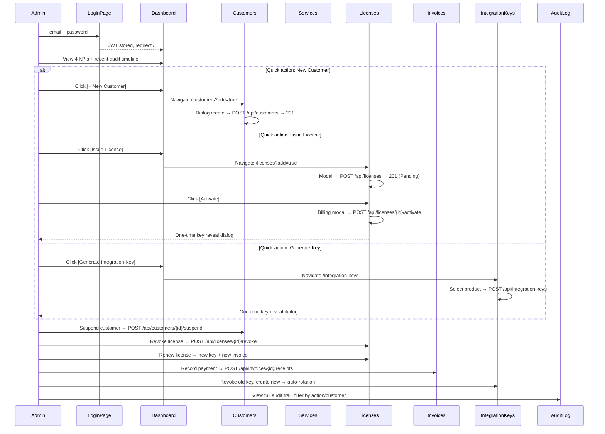

# Wireframes — Platform Admin UI

All screens use [design-system.md](design-system.md) tokens. **Mobile-ready, desktop-optimized** — responsive across all viewports.

---

## 1. App flow



### Entity relationships

```
Customer ──1:N──> License ──1:N──> AuditLog
                 License ──1:N──> Invoice ──1:N──> Receipt
ServiceProduct ──1:N──> License
ServiceProduct ──1:N──> IntegrationKey   (only 1 active at a time)
Customer ──1:N──> Invoice
```

---

## 2. Information architecture

```
Platform Admin
├── Login                   /login    (no shell — dedicated layout)
├── Dashboard               /
├── Customers               /customers
│   └── (detail drawer: Profile | Licenses | Invoices | Audit)
├── Service Catalog          /services
├── Licenses                /licenses
├── Invoices                /invoices
│   └── /invoices/{id}      (detail page)
├── Integration Keys        /integration-keys
├── Audit Log               /audit
└── Validate License        /validate  (alias: /tools/validate)
```

`/customers/{id}/licenses` is resolved by navigating `/licenses?customerId={id}` — no dedicated page needed.

---

## 3. Responsive system

### Breakpoints

Full cheat sheet (shell vs page vs MudBlazor): [design-system.md](design-system.md#breakpoint-cheat-sheet).

| Token | Width | Role |
|-------|-------|------|
| `xs` | <600px | Default mobile base — all styles start here |
| `sm` | ≥600px | Small tablet — widens layouts, 2-column grids |
| `md` | ≥960px | Desktop — multi-column, DataGrid, inline filters |
| `lg` | ≥1280px | Wide desktop — 4-column KPIs, 48px page padding |
| `xl` | ≥1920px | Ultra-wide — centered content, outer max-width |

> **Navigation shell** uses **`nav-lg` = 1024px** (rail vs overlay) and **`nav-md` = 768px** (mobile vs tablet overlay styling). See [navigation-shell.md](navigation-shell.md). Page layout breakpoints above still apply to grids and content.

### Typography scale

| Element | xs (default) | sm+ | md+ |
|---------|-------------|-----|-----|
| H1 / page title | 1.375rem (22px) | 1.625rem | 2rem |
| H2 / section heading | 1.125rem (18px) | 1.25rem | 1.5rem |
| Body text | 0.875rem (14px) | — | 1rem |
| KPI value | 1.75rem (28px) | 2rem | 2.5rem |
| Small / caption | 0.75rem (12px) | — | 0.8125rem |
| Code / mono (keys, JSON) | 0.8125rem (13px) | — | — |
| Button text | 0.875rem | — | — |
| Label | 0.8125rem | — | — |

### Component sizing

| Component | xs (<600px) | sm (600–959px) | md+ (≥960px) |
|-----------|------------|----------------|---------------|
| Buttons | Full width, min-height 44px | Auto width, min-height 40px | Auto width |
| KPI cards | Full width, 16px padding | 2 per row, 20px padding | 4 per row, 24px padding |
| Dialogs / modals | Full-screen bottom sheet or 90vw, border-radius 1rem top only | Centered, max-width 480px, border-radius 1rem | Centered, max-width 560px, border-radius 1.25rem |
| Form fields | Full width, stacked | Full width, stacked | Inline pairs where logical |
| Data display | Card list (1 row = 1 card) | Card list or compact table | `MudDataGrid` all columns |
| Filter bar | Collapsed in `MudExpansionPanel` | Expandable, collapsed default | Inline, always visible |
| Page padding | 1rem (16px) | 1.5rem (24px) | 2rem (32px) |
| Grid gutter | 16px | 24px | 24px |
| Snackbar | Full width, bottom | Centered, max-width 400px | Centered, max-width 480px |

### Navigation / Drawer

Canonical spec: [navigation-shell.md](navigation-shell.md).

| Screen | < 768px (mobile) | 768–1023px (tablet) | ≥ 1024px (desktop) |
|--------|------------------|---------------------|---------------------|
| Rail | Hidden; hamburger | Hidden; hamburger | **64px** icon rail always visible |
| Overlay | **Left 280px** (max 85vw) | **Left 280px** | — |
| Main offset | None | None | Fixed **`margin-left: 64px`** |
| Hamburger | Visible | Visible | Hidden |
| Scrim | `rgba(16,21,12,0.9)` + blur | `rgba(0,0,0,0.6)` + blur | — |
| Drawer header | Avatar + close | Avatar only | — |
| Drawer footer | Logout button | System Status card | Settings row |
| Active nav | 2px `--accent` border, `--primary` text | Same | Same |
| Nav labels | Inter 14px, always visible | JetBrains Mono 13px | JetBrains Mono 13px; hidden until sidebar hover/focus-within |

---

## Form patterns

**Canonical source:** [screens.md](screens.md#form-patterns) — MudForm validation, password toggle, keyboard, loading, errors, and snackbar rules. Do not duplicate here; wireframes reference that section only.

Also see [design-system.md](design-system.md#destructive-confirmation-dialog) for destructive confirms and [design-system.md](design-system.md#feedback-states) for empty/loading/error/snackbar patterns.

---

## 4. Shell wireframe

See [navigation-shell.md](navigation-shell.md) for tokens and MudBlazor mapping.

### Desktop mini-drawer (≥ 1024px)

```
┌──────────────────────────────────────────────────────────────────────────┐
│ APP BAR  sticky z-40  var(--bg-base)  64px                                │
│ [▣] Platform Admin              DisplayName / Superuser    Logout          │
├──────┬───────────────────────────────────────────────────────────────────┤
│RAIL  │ MAIN  var(--bg-base)  margin-left: 64px (fixed)                    │
│64px  │ padding: 24px → 48px (lg+)  .page-content centered column          │
│ hover│  @Body                                                            │
│ →280│  (sidebar hover expands OVER content, no layout push)              │
│ [≡] │                                                                    │
│profile│  Nav profile footer (avatar + name on expand)                    │
└──────┴───────────────────────────────────────────────────────────────────┘
```

### Tablet overlay (768–1023px)

```
┌──────────────────────────────────────────────────┐
│ APP BAR                                           │
│ [≡] Platform Admin                        Logout  │
├──────────────────────────────────────────────────┤
│ @Body   full width, padding 24px                  │
│  (tap ≡ → left 280px drawer + 60% scrim)         │
│ ┌──────────────────────────────────────────────┐ │
│ │ [avatar] Admin / Superuser                   │ │
│ │ [icon] Dashboard                             │ │
│ │ ...                                          │ │
│ │ [profile footer: Admin / Superuser]            │ │
│ └──────────────────────────────────────────────┘ │
└──────────────────────────────────────────────────┘
```

### Mobile overlay (< 768px)

```
┌──────────────────────────────────────────────────┐
│ APP BAR                                           │
│ [≡] Platform Admin                        Logout  │
├──────────────────────────────────────────────────┤
│ @Body   full width, padding 24px                  │
│  (tap ≡ → left 280px drawer, max 85vw)           │
│ ┌──────────────────────────────────────── [×] ─┐ │
│ │ [avatar] Admin / Superuser                   │ │
│ │ [icon] Dashboard                             │ │
│ │ ...                                          │ │
│ │ [profile footer: Admin / Superuser]            │ │
│ └──────────────────────────────────────────────┘ │
└──────────────────────────────────────────────────┘
```

### Shell component spec

| Element | Component | Spec |
|---------|-----------|------|
| AppBar | `MudAppBar` | 64px, `--bg-base`, `--border-subtle` bottom border, Elevation 0, sticky |
| Brand | `MudText` | “Platform Admin”, Inter 700, `--primary` |
| Hamburger | `MudIconButton` | `Menu` icon; visible **< 1024px** only |
| Desktop app bar | Custom markup | Terminal logo badge, user meta, logout (search/notifications deferred) |
| User actions (compact) | `MudButton` | Logout only |
| Desktop rail | `aside.platform-sidebar-rail` | 64px; CSS hover → **280px**; profile footer |
| Overlay drawer | `MudDrawer` Temporary | < 1024px; Admin Menu header; profile footer |
| Nav | `NavMenu.razor` | Custom `NavLink` rows; profile footer all tiers |
| Nav active | | `--primary` text, **2px `--accent` border**, `--surface-container-highest` bg |
| Main content | `MudMainContent` | `--bg-base`, fixed 64px left offset ≥ 1024px |
| Layout root | `MudLayout` | `--bg-base` background |

---

## 5. Login `/login`

No shell layout — dedicated `LoginLayout` with full-viewport centered card. Follows [Form patterns](#form-patterns).

### Layout states

```
xs (<600px)                    sm (600–959px)               md+ (≥960px)
┌──────────────────┐       ┌────────────────────┐       ┌──────────────────────┐
│ (full height)    │       │                    │       │                      │
│                  │       │  ┌──────────────┐  │       │  ┌────────────────┐  │
│ ┌──────────────┐ │       │  │              │  │       │  │                │  │
│ │              │ │       │  │   [logo]     │  │       │  │    [logo]      │  │
│ │   [logo]     │ │       │  │   7rem       │  │       │  │    8.5rem      │  │
│ │   5.5rem     │ │       │  │              │  │       │  │                │  │
│ │              │ │       │  ├──────────────┤  │       │  ├────────────────┤  │
│ ├──────────────┤ │       │  │ Sign in to   │  │       │  │ Sign in to     │  │
│ │ Sign in to   │ │       │  │ manage...    │  │       │  │ manage         │  │
│ │ manage...    │ │       │  ├──────────────┤  │       │  │ licenses and   │  │
│ ├──────────────┤ │       │  │              │  │       │  │ customers      │  │
│ │              │ │       │  │ Email        │  │       │  ├────────────────┤  │
│ │ Email        │ │       │  │              │  │       │  │                │  │
│ │              │ │       │  │ Password     │  │       │  │ Email          │  │
│ │ Password     │ │       │  │              │  │       │  │                │  │
│ │              │ │       │  │ [Sign in]    │  │       │  │ Password       │  │
│ │ [Sign in]    │ │       │  │              │  │       │  │                │  │
│ │  full width  │ │       │  └──────────────┘  │       │  │ [Sign in]      │  │
│ └──────────────┘ │       │                    │       │  │                │  │
│                  │       │                    │       │  └────────────────┘  │
└──────────────────┘       └────────────────────┘       └──────────────────────┘
  padding: 1rem             padding: 2rem                padding: 3rem
  card: 90vw                card: max 30rem              card: max 30rem
```

### Short viewport fallback (<500px height)
```
┌────────────────────────────────┐
│  [logo] 3rem                   │
│  (subtitle hidden)             │
│  Email | Password | [Sign in]  │
│  padding: 1rem, gap reduced    │
└────────────────────────────────┘
```

### Login component spec

| Element | Component | Spec |
|---------|-----------|------|
| Layout | `LoginLayout` | `--bg-base` + subtle radial gradient (green glow at edges), center content vertically + horizontally |
| Card | `MudPaper` | max-width 30rem, width 100% on xs → capped at 30rem on sm+, glass morphism (`backdrop-filter: blur(24px)`), `--bg-surface` at 85% opacity |
| Card border | | `1px solid` `--accent` at 10% opacity |
| Card shadow | | outer dark shadow + inset subtle highlight |
| Card corners | | border-radius: 1.5rem (xs) → 1.75rem (sm) → 2rem (md+) |
| Card padding | | `pa-5` (1.25rem) xs → `pa-sm-7` (1.75rem) sm → `pa-md-8` (2rem) md+ |
| Logo | `` `login-logo.png` | **4.5rem** (ultra-narrow) → **5.5rem** (xs) → **7rem** (sm) → **8.5rem** (md+) |
| Logo corners | | border-radius: 1.125rem (xs) → 1.25rem (sm) → 1.75rem (md+), subtle green glow shadow |
| Logo shadow | | `0 4px 24px` `--accent` at 15% opacity |
| Subtitle | `MudText` Typo.body2 | "Sign in to manage licenses and customers", `--text-secondary`, centered, 0.875rem |
| Divider | `MudDivider` | subtle, `--accent` at 8% opacity, margin below |
| Email field | `MudTextField` | Outlined variant, full width, label "Email", type email, autocomplete "email" |
| Password field | `MudTextField` | Outlined variant, full width, label "Password", toggle visibility adornment icon |
| Submit button | `MudButton` Variant.Filled | `--accent` background, `--bg-base` text, full width xs → auto width sm+, min-height 3rem, border-radius 0.75rem, font-weight 600 |
| Submit hover | | glow shadow (`0 4px 20px` `--accent` at 25%), translate up 1px |
| Submit loading | | `MudProgressCircular` spinner + "Signing in..." |
| Error alert | `MudAlert` Severity.Error | Outlined, border-radius 0.75rem, closable |
| Animation | CSS keyframe | Slide up + fade in (0.5s), disabled on `prefers-reduced-motion` |
| Accessibility | | Tab order: Email → Password → Sign in. Enter submits. Focus ring `--accent`. All labels readable. |

---

## 6. Dashboard `/`

API: `GET /api/dashboard/stats` → `{ CustomerCount, ActiveLicenses, ExpiringWithin30Days, UnpaidInvoices }`

Reference: Tailwind dashboard mock (May 2026) — asymmetric timeline + sidebar quick actions.

### Desktop (lg+, ≥1280px)

```
┌──────────────────────────────────────────────────────────────────────────┐
│ H1 Dashboard (primary)                                                   │
│ Platform overview and performance metrics.                               │
├──────────────────────────────────────────────────────────────────────────┤
│ KPI 4-col grid  gutter 16px                                              │
│ ┌──────────────┐ ┌──────────────┐ ┌──────────────┐ ┌──────────────┐     │
│ │ TOTAL CUST.  │ │ ACTIVE LIC.  │ │ EXPIRING 30D │ │ UNPAID INV.  │     │
│ │ [icon]       │ │ [icon]       │ │ [icon]       │ │ [icon]       │     │
│ │     42       │ │     128      │ │      5       │ │     12       │     │
│ │ --accent 32px│ │ --accent     │ │ --accent     │ │ --accent     │     │
│ │ Registered…  │ │ Healthy…     │ │ Attention…   │ │ Pending…     │     │
│ └──────────────┘ └──────────────┘ └──────────────┘ └──────────────┘     │
├──────────────────────────────────────────────────────────────────────────┤
│ MAIN 2:1 grid  section-gap 32px                                          │
│ ┌─────────────────────────────────────┐ ┌──────────────────────────┐  │
│ │ Recent Activity    [Live Stream]    │ │ Quick Actions            │  │
│ │ ● LicenseActivated — Acme Corp      │ │ [+ New Customer] primary │  │
│ │   details…           2 MINUTES AGO  │ │ [Issue License] outline  │  │
│ │ ○ CustomerCreated — Stark Ind.      │ │ [Generate Integ. Key]    │  │
│ │ ...                                 │ ├──────────────────────────┤  │
│ │ [ View Full Audit Log ]             │ │ Platform Health          │  │
│ └─────────────────────────────────────┘ │ API Uptime ████████ 99%  │  │
│                                         │ Sync Queue ▏ 0%          │  │
│                                         └──────────────────────────┘  │
└──────────────────────────────────────────────────────────────────────────┘
```

### Tablet / mobile

- KPI: 2-col (sm) → 1-col (xs)
- Main grid stacks: timeline first, sidebar second
- Quick actions remain full-width stacked

### Dashboard component spec

| Element | Component | Spec |
|---------|-----------|------|
| Page header | native `<header>` | H1 `--primary` + subtitle `--text-secondary` |
| Metrics grid | CSS grid | `1 / 2 / 4` columns responsive |
| Metric card | `<article.kpi-card>` | `--bg-surface`, border, 24px padding, hover `--primary` border |
| Metric label | `<span>` | JetBrains Mono uppercase 11px |
| Metric value | `<div>` | 32px bold `--accent` |
| Metric footnote | `<div>` | contextual mono caption |
| Timeline panel | `<section>` | custom vertical timeline, not MudTimeline |
| Timeline dot | CSS | primary / error / neutral variants |
| Quick actions | `<button>` stack | primary + outlined per reference |
| Platform Health | static module | progress bars, decorative |
| View all | `<button.view-audit-btn>` | full width, mono uppercase, → `/audit` |
| Loading | `MudSkeleton` | 4 KPI + main panel |

---

## 7. Customers `/customers`

API: `GET /api/customers?page=1&pageSize=25`, `POST`, `PUT`, `POST /suspend`, `POST /reactivate`

Reference mock: Customers page (May 2026).

### Desktop layout

```
┌──────────────────────────────────────────────────────────────────────────┐
│ H1 Customers                          [ + New Customer ] primary CTA     │
│ Manage platform accounts, licensing, and billing entities.             │
├──────────────────────────────────────────────────────────────────────────┤
│ FILTERS (surface-container-low, rounded-xl)                              │
│ [ 🔍 Search........................ ] [Status ▼] [Created ▼]           │
├──────────────────────────────────────────────────────────────────────────┤
│ TABLE PANEL (rounded-xl)                                               │
│ NAME (avatar+ID) │ EMAIL │ PHONE │ STATUS │ LIC │ CREATED │ ⋮          │
│ AD Aether Dyn.   │ ...   │ ...   │ Active │ 124 │ Oct 12  │ ⋮          │
│ ...                                                                      │
│ Showing 1–25 of N                              [ < 1 2 3 > ]             │
└──────────────────────────────────────────────────────────────────────────┘

Row click or ⋮ → right drawer (480px):
┌─────────────────────────────┐
│ [AD] Aether Dynamics  [×]   │
│ Active badge                │
├─────────────────────────────┤
│ Profile│Licenses│Invoices│Audit│
├─────────────────────────────┤
│ GENERAL INFORMATION         │
│ [email card] [phone card]   │
│ NOTES (blockquote)            │
├─────────────────────────────┤
│ [Edit Record] [Suspend]     │
└─────────────────────────────┘
```

### Component spec

| Element | Spec |
|---------|------|
| Page header | native `<header>` + `.btn-new-customer` |
| Filters | `.customers-filters` — search + status + created selects |
| Table panel | `.customers-table-panel` wrapping styled `MudDataGrid` |
| Name cell | `.customer-avatar` initials + `.customer-name-text` + mono ID |
| Status badge | `.status-badge-active` / `.status-badge-suspended` |
| Row menu | `MudMenu` MoreVert |
| Create | `CustomerCreateDialog` (not inline expansion panel) |
| Drawer | `CustomerDetailDrawer` — custom tabs, footer actions |
| Empty | `.customers-empty` + CTA |

### Responsive

| xs | md+ |
|----|-----|
| Filters stack | Filters inline row |
| Drawer full width | Drawer 480px |
| Horizontal scroll table | Full table |

---

## 8. Service Catalog `/services`

API: `GET /api/serviceproducts`, `POST`, `PUT`

Reference mock: Service Catalog page (May 2026).

### Desktop layout

```
┌──────────────────────────────────────────────────────────────────────────┐
│ [✓] Service "Auth Core" created successfully.  [Generate Integ. Key]   │
├──────────────────────────────────────────────────────────────────────────┤
│ H1 Service Catalog                        [ + Add Service ] primary    │
│ Manage microservices, API endpoints, and system-level integrations.      │
├──────────────────────────────────────────────────────────────────────────┤
│ BENTO STATS (4 cards)                                                    │
│ Active Services │ System Uptime │ Total Licenses │ Key Coverage ████ 82% │
├──────────────────────────────────────────────────────────────────────────┤
│ TABLE PANEL (rounded, surface-container)                               │
│ NAME (dot) │ CODE badge │ DESCRIPTION │ AVAIL switch │ INT KEY │ ACT   │
│ ● Edge Proxy │ EPA-204-X │ …           │ [====●]      │ PROD_KEY│ ✎ 🔑  │
│ ...                                                                      │
│ Showing 1–4 of 4 results                                               │
├──────────────────────────────────────────────────────────────────────────┤
│ INSIGHTS (2-col)                                                         │
│ Service Performance Matrix (bar chart) │ Automated Health Checks glass  │
└──────────────────────────────────────────────────────────────────────────┘
```

### Component spec

| Element | Component | Spec |
|---------|-----------|------|
| Success banner | custom `.services-success-banner` | Post-create only; primary border; Generate Key CTA |
| Page header | native `<header>` | H1 + subtitle + Add Service button |
| Stats grid | CSS grid 1/4 cols | Active Services, Uptime (static), Total Licenses, Key Coverage + bar |
| Data | `MudTable` in `.services-table-panel` | Hover row actions (Edit, Keys) |
| Available toggle | `MudSwitch` | Inline PUT on change |
| Integration Key | custom chip | Active: mono `{CODE}_KEY`; None: error badge |
| Table footer | mono caption | Result count |
| Insights | 2-card grid | Decorative chart + glass health card |
| Create | `ServiceProductCreateDialog` | Warning alert + form fields |
| Edit | `ServiceProductEditDialog` | Code readonly |

### Add/Edit service dialog

Follows [Form patterns](#form-patterns).

| Field | Component | Notes |
|-------|-----------|-------|
| Name | `MudTextField` | Required, max 200 |
| Code | `MudTextField` | Required, max 50, auto-uppercase on create |
| Description | `MudTextField` multiline | Optional, max 2000 |
| Available for sale | `MudSwitch` | Default true |

Create dialog includes `MudAlert` Severity.Warning about irrecoverable keys.

### Post-create integration key prompt

After successful service creation (POST → 201):

```
┌──────────────────────────────────────────────────────────────────────────┐
│ ✓  Service "Authentication Core" created successfully.                     │
│    Ready for deployment. You need a secure key for API access.             │
│                                              [ 🔑 Generate Integration Key ]│
└──────────────────────────────────────────────────────────────────────────┘
```

**On [Generate Integration Key]:** navigate to `/integration-keys?productId={id}` (generate + one-time reveal on that page).

### Responsive

| xs (<600px) | md+ (≥768px) |
|-------------|--------------|
| Stats 1-col | Stats 4-col |
| Header stacks | Header row |
| Insights stack | Insights 2-col |
| Table horizontal scroll | Full width table |

---

## 9. Licenses `/licenses`

API: `GET /api/licenses?page=1&pageSize=25&customerId=`, `POST`, `POST /activate`, `POST /renew`, `POST /suspend`, `POST /revoke`, `PUT`

Reference mock: Licenses page (May 2026).

### Desktop layout

```
┌──────────────────────────────────────────────────────────────────────────┐
│ H1 Licenses                               [ + Issue License ] primary    │
│ Manage software entitlements and API access keys.                        │
├──────────────────────────────────────────────────────────────────────────┤
│ FILTERS (4-col grid, mono uppercase labels)                              │
│ CUSTOMER ▾     │ SERVICE ▾      │ STATUS ▾       │ [ More Filters ]     │
├──────────────────────────────────────────────────────────────────────────┤
│ TABLE PANEL (rounded-lg, multi-select)                                   │
│ ☐ │ CUSTOMER (name+ID) │ SERVICE │ PLAN │ STATUS │ EXPIRES │ KEY │ ⋮   │
│ ☐ │ Acme Corp          │ Cloud   │ Ent  │ Active │ 2025-12 │ YES │ ⋮   │
│ ...                                                                      │
│ Showing 1–25 of 124                              [ < 1 2 3 > ]           │
└──────────────────────────────────────────────────────────────────────────┘

┌── BULK BAR (fixed bottom, glass, when selected) ─────────────────────────┐
│ (3) Items selected │ Rotate Keys │ Renew │ Revoke │ ✕                    │
└──────────────────────────────────────────────────────────────────────────┘
```

### Component spec

| Element | Component | Spec |
|---------|-----------|------|
| Page header | native `<header>` | H1 + subtitle + Issue License button |
| Filters | 4-col CSS grid | Customer/Service/Status selects + More Filters toggle |
| More filters | expandable panel | Search field + Apply |
| Data | `MudDataGrid<T>` multi-select | `.licenses-grid` styled panel |
| Status | custom pill badges | Active fill, Expired error, outline variants |
| Key Sent | YES/NO chips | check/cancel icons |
| Row actions | `MudMenu` MoreVert | Activate, Renew, Edit, Suspend, Revoke by status |
| Bulk bar | `.licenses-bulk-bar` | Glass panel, slide-up animation |
| Issue | `LicenseIssueDialog` | Replaces expansion panel |

### Issue License modal

Follows [Form patterns](#form-patterns).

```
┌──────────────────────────────────────────┐
│  Issue License                           │
│  Customer    [select ▾]                  │
│  Service     [select ▾]                  │
│  Plan Name   [___________________]       │
│  Expires At  [📅 mm/dd/yyyy]  (optional) │
│                [ Cancel ]  [ Issue ]     │
└──────────────────────────────────────────┘
```

Submit → `POST /api/licenses` → 201, status=Pending.

### Activate License flow (two-step)

**Step 1 — Billing modal (follows [Form patterns](#form-patterns)):**

```
┌──────────────────────────────────────────┐
│  Activate License                        │
│  Plan: Pro Annual — HOSTEL — Acme        │
│  ────────────────────────────────        │
│                                          │
│  Subtotal   [ 299.00        ]  USD       │
│  Tax        [ 0.00          ]            │
│  Due Date   [📅 mm/dd/yyyy]  (optional)  │
│  Description[________________]  (opt)    │
│                                          │
│  An invoice will be created and the      │
│  license key will be emailed to the      │
│  customer.                               │
│  ────────────────────────────────        │
│                [ Cancel ]  [ Activate ]  │
└──────────────────────────────────────────┘
```

Submit → `POST /api/licenses/{id}/activate` → API generates key, creates invoice, emails customer.

**Step 2 — One-time key reveal (immediately after activation):**

```
┌──────────────────────────────────────────┐
│  ⚠ License Activated                     │
│  ────────────────────────────────        │
│                                          │
│  License key for Acme / HOSTEL           │
│  Pro Annual                              │
│                                          │
│  ┌──────────────────────────────────┐    │
│  │ pk_HOSTEL_x7f3a9c2e1b4d         │    │
│  │                         [📋 Copy]│    │
│  └──────────────────────────────────┘    │
│                                          │
│  This key has been emailed to            │
│  demo@acme.example                       │
│                                          │
│  ⚠ Copy this key now. It cannot be      │
│  retrieved again after you close         │
│  this dialog.                            │
│                                          │
│  ────────────────────────────────        │
│                     [ I've Saved It ]    │
└──────────────────────────────────────────┘
```

### Renew License

Follows [Form patterns](#form-patterns). Same two-step modal as Activate, but with additional new `ExpiresAt` date picker. Submit → `POST /api/licenses/{id}/renew` → new key generated, new invoice created.

### Suspend / Revoke

| Action | Confirm dialog |
|--------|---------------|
| Suspend | "Suspend license for {Customer} — {Service}? The license will be denied immediately." |
| Revoke | "Revoke license for {Customer} — {Service}? This is permanent and cannot be undone." Destructive styling |

### Responsive

| xs (<600px) | md+ (≥768px) |
|-------------|--------------|
| Filters stack | Filters 4-col |
| Bulk bar wraps | Bulk bar centered |
| Issue/Activate: bottom sheet | Centered 520px |
| Key reveal: full-screen | Centered 480px |

---

## 10. Invoices `/invoices`

API: `GET /api/invoices?page=1&pageSize=25&customerId=`, `POST`, `POST /void`

Reference mock: Invoices page (May 2026).

### Desktop layout

```
┌──────────────────────────────────────────────────────────────────────────┐
│ H1 Invoices (primary)              [ CREATE INVOICE ] [ EXPORT CSV ]     │
│ Manage billing, customer accounts, and transaction history.              │
├──────────────────────────────────────────────────────────────────────────┤
│ BENTO STATS (4 cards)                                                    │
│ TOTAL REVENUE │ OUTSTANDING │ PAID THIS MONTH │ QUICK FILTER chips       │
├──────────────────────────────────────────────────────────────────────────┤
│ FILTERS PANEL (surface-container-low)                                    │
│ CUSTOMER search │ STATUS ▾ │ DATE RANGE │ [ RESET ] [ FILTER ]          │
├──────────────────────────────────────────────────────────────────────────┤
│ TABLE PANEL                                                              │
│ INV # │ CUSTOMER (avatar) │ TOTAL │ PAID │ DUE │ STATUS │ DATE │ ⋮     │
│ ...                                                                      │
│ SHOWING 1–25 OF N                                                        │
├──────────────────────────────────────────────────────────────────────────┤
│ INSIGHTS (2:1)                                                           │
│ Automated Billing Rules card │ Q3 Projection bar card                    │
└──────────────────────────────────────────────────────────────────────────┘
```

### Invoice list component spec

| Element | Component | Spec |
|---------|-----------|------|
| Page header | native `<header>` | Primary H1 + dual CTAs |
| Stats bento | CSS grid 1/4 | Revenue, Outstanding, Paid this month, Quick filter chips |
| Filters | `.invoices-filters-panel` | Customer search, Status, DateRange, Reset/Filter |
| Data | `MudDataGrid<T>` | `.invoices-grid`, row click → detail |
| Status badges | custom pills | Paid, Sent, Partially Paid, Overdue, Draft, Void |
| Row highlight | CSS | Overdue rows error tint |
| Export | JS download | Current filtered rows → CSV |
| Insights | 2-card grid | Billing rules + projection (decorative) |

### Invoice Detail `/invoices/{id}`

```
Desktop (md+):
┌────────────────────────────────────────────────────────────────────────┐
│ ← Back to Invoices                                                     │
│                                                                        │
│ H1 Invoice INV-2026-00001                          Status: Sent        │
├────────────────────────────────┬───────────────────────────────────────┤
│ Customer: Acme Corp            │  Subtotal:     $299.00                │
│ Service:  HOSTEL               │  Tax:            $0.00                │
│ License:  (linked if exists)   │  Total:        $299.00                │
│ Plan:     Pro Annual           │  Paid:           $0.00                │
│ Issued:   May 15, 2026         │  Due:          $299.00                │
│ Due:      Jun 15, 2026         │                                       │
├────────────────────────────────┴───────────────────────────────────────┤
│ RECEIPTS                                                               │
│ ┌────────────────────────────────────────────────────────────────────┐ │
│ │ #               │ Amount │ Method       │ Date       │ Notes       │ │
│ │ RCP-2026-00001  │ $150   │ BankTransfer │ May 20     │ First half  │ │
│ └────────────────────────────────────────────────────────────────────┘ │
│                                                     [Record Payment]   │
│                                                     [Void Invoice]     │
└────────────────────────────────────────────────────────────────────────┘
```

### Record Payment dialog

Follows [Form patterns](#form-patterns).

```
┌──────────────────────────────────────────┐
│  Record Payment                          │
│  Invoice INV-2026-00001                  │
│  Amount Due: $299.00                     │
│  ────────────────────────────────        │
│                                          │
│  Amount          [ 150.00       ]        │
│  Method          [BankTransfer ▾]        │
│  Reference       [________________]      │
│  Paid At         [📅 mm/dd/yyyy]         │
│  Notes           [________________]      │
│                                          │
│  ────────────────────────────────        │
│              [ Cancel ]  [ Record ]      │
└──────────────────────────────────────────┘
```

Submit → `POST /api/invoices/{invoiceId}/receipts` → receipt number auto-generated. Invoice status auto-recalculated.

### Create Invoice

Follows [Form patterns](#form-patterns). Same billing fields as Activate modal but manual customer selection + optional license/service link.

### Void Invoice

Only available on Draft / Sent / Overdue with zero receipts. Confirm dialog with reason.

### Responsive

| xs (<600px) | sm (600–959px) | md+ (≥960px) |
|-------------|----------------|--------------|
| Card list, tap → detail page | Card list, tap → detail page | `MudDataGrid`, row click → detail |
| Detail: single column, stacked | Detail: 2-col amounts | Detail: 2-col layout |
| Record payment: bottom sheet | Centered 400px | Centered 480px |
| Receipts: compact list | Receipts: compact table | Receipts: full table |

---

## 11. Integration Keys `/integration-keys`

API: `GET /api/integration-keys?serviceProductId=`, `POST`, `POST /{id}/revoke`

Reference mock: Integration Keys page (May 2026).

### Desktop layout

```
┌──────────────────────────────────────────────────────────────────────────┐
│ H1 Integration Keys (primary)              [ + Generate New Key ]        │
│ Manage API credentials and authentication tokens...                      │
├──────────────────────────────────────────────────────────────────────────┤
│ ⚠ SECURITY NOTICE (error-toned banner)                                   │
├──────────────────────────────────────────────────────────────────────────┤
│ STATS (3 cards): Active Keys │ Requests/24h │ Avg Latency                │
├──────────────────────────────────────────────────────────────────────────┤
│ BENTO GRID (auto-fill cards)                                             │
│ ┌─────────────────────┐ ┌─────────────────────┐                          │
│ │ [icon] Hostel Inv.  │ │ [icon] Stripe Conn. │                          │
│ │ Active pill         │ │ pk_STRP_••••••      │                          │
│ │ pk_HOSTEL_••••••    │ │ Created · Revoke    │                          │
│ └─────────────────────┘ └─────────────────────┘                          │
└──────────────────────────────────────────────────────────────────────────┘
```

### Component spec

| Element | Component | Spec |
|---------|-----------|------|
| Page header | native `<header>` | Primary H1 + Generate New Key |
| Security alert | `.integration-keys-alert` | Error border/bg, warning icon |
| Stats | CSS grid 1/3 | Active Keys real; traffic/latency decorative |
| Key cards | `.integration-keys-bento` | Icon, name, subtitle, masked key, revoke |
| Generate | `IntegrationKeyGenerateDialog` | Service select + warning |
| Reveal | `IntegrationKeyRevealDialog` | One-time plain key, no backdrop dismiss |
| Revoke | `ConfirmDialog` | Irreversible disconnect warning |

### Generate Key flow

**Step 1 — Select service:**

```
┌──────────────────────────────────────────┐
│  Generate Integration Key                │
│  ⚠ Creating a new key will revoke...     │
│  Service   [HOSTEL ▾]                    │
│              [ Cancel ]  [ Generate ]    │
└──────────────────────────────────────────┘
```

**Step 2 — One-time key reveal:**

```
┌──────────────────────────────────────────┐
│  ⚠ Integration Key Created               │
│  Service: HOSTEL — Hostel Management     │
│  ┌──────────────────────────────────┐    │
│  │ pk_HOSTEL_x7f3a9c2e1b4d  [Copy]  │    │
│  └──────────────────────────────────┘    │
│  ⚠ Store securely. X-Integration-Key    │
│                     [ I've Saved It ]    │
└──────────────────────────────────────────┘
```

Submit → `POST /api/integration-keys?serviceProductId={id}`.

### Revoke Key

Confirm: irreversible disconnect message → card removed/refreshed.

### Responsive

| xs | md+ |
|----|-----|
| Stats stack | Stats 3-col |
| Bento 1-col | Bento auto-fill min 320px |

---

## 12. Audit Log `/audit`

API: `GET /api/audit-logs?limit=500&customerId=&licenseId=&action=`

Reference mock: Audit Log page (May 2026).

### Desktop layout

```
┌──────────────────────────────────────────────────────────────────────────┐
│ H1 Audit Log (primary)     [ Search logs... ] [ Export CSV ]             │
│ Comprehensive tracking of all administrative actions...                  │
├──────────────────────────────────────────────────────────────────────────┤
│ FILTERS: Action ▾ │ Customer ▾ │ Refresh                                  │
├──────────────────────────────────────────────────────────────────────────┤
│ TABLE (expandable rows)                                                  │
│ ▶ │ TIMESTAMP │ ADMIN (avatar) │ ACTION badge │ TARGET │ IP │ ⋮         │
│ ▼ │ ...       │ ...            │ LICENSE_...  │ ...    │ .. │           │
│   │ DETAILS_JSON                                    [ Copy ]             │
│   │ { formatted green JSON }                                               │
├──────────────────────────────────────────────────────────────────────────┤
│ Items per page: 25 │ 1–25 of N │ ◀ ▶ pagination                          │
├──────────────────────────────────────────────────────────────────────────┤
│ STATS: Total Logs │ Security Flags │ Avg Retained │ Storage Used         │
└──────────────────────────────────────────────────────────────────────────┘
```

### Component spec

| Element | Component | Spec |
|---------|-----------|------|
| Page header | native `<header>` | Primary H1 + inline search + Export CSV |
| Filters | `.audit-filters-panel` | Action, Customer, Refresh |
| Data | custom `<table.audit-table>` | Expandable rows with chevron |
| Action badges | CSS pills | PRIMARY / NEUTRAL / DANGER by action type |
| JSON panel | `.audit-details-panel` | Pretty-printed primary mono JSON + copy |
| Pagination | client-side | Page size select + nav buttons |
| Stats | 4-card grid | Total, security flags, retention, storage |

### Audit action list (20 actions)

Same enum list as screens.md — displayed as `UPPER_SNAKE_CASE`.

### Responsive

| xs | md+ |
|----|-----|
| Header stacks | Header row |
| Table scroll | Full width |
| Stats stack | Stats 4-col |

---

## 13. Validate License `/validate`

Canonical route **`/validate`**. Alias **`/tools/validate`** → same page.

API: `POST /api/licenses/validate` (AllowAnonymous, rate-limited 60/min)

Reference mock: License Debugger page (May 2026).

### Desktop layout

```
┌──────────────────────────────────────────────────────────────────────────┐
│ H1 License Debugger (primary)                                            │
│ Low-level validation tool for verifying license key integrity...         │
├───────────────────────────────┬──────────────────────────────────────────┤
│ INPUT PARAMETERS (5-col)      │ RESPONSE TERMINAL (7-col)                │
│ License Key textarea          │ ● ● ● response_log.json    [Copy][Clear]  │
│ Service Context ▾             │ { pretty JSON or awaiting... }           │
│ 🔑 X-Integration-Key          │ Status: 200 OK │ Latency: 84ms          │
│ [ ⚡ Test Validation ]        │                                          │
│ ℹ Validation API info card    │ Decorative validator card                │
└───────────────────────────────┴──────────────────────────────────────────┘
```

### Component spec

| Element | Component | Spec |
|---------|-----------|------|
| Page header | native `<header>` | “License Debugger” + subtitle |
| Input panel | `.validate-input-panel` | Terminal icon + labeled fields |
| Service select | `MudSelect` | Product codes from catalog, optional |
| Integration key | icon-prefixed input | Mono styling |
| Test button | `.btn-test-validation` | Full width primary + bolt icon |
| Info card | `.validate-info-card` | API endpoint + rate limit |
| Terminal | `.validate-terminal` | Black bg, toolbar, JSON body, status bar |
| Copy/Clear | toolbar buttons | Clipboard + reset |
| Decorative | `.validate-decorative-card` | Validator behavior note |

### Responsive

| xs | lg+ |
|----|-----|
| Stack columns | 5:7 grid |

---

## 14. Implementation phases

| UI Phase | Screens | Key dependencies |
|----------|---------|------------------|
| **UI-1** | Shell (MainLayout + NavMenu) + Login + Dashboard | `design-system.md` MudTheme, `POST /api/auth/login`, `GET /api/dashboard/stats`, `GET /api/audit-logs` |
| **UI-2** | Customers + Service Catalog + post-create key prompt | `GET/POST/PUT /api/customers`, `GET/POST/PUT /api/serviceproducts`, `POST /api/integration-keys` |
| **UI-3** | Licenses + Activate/Renew flow + Key reveal | `GET/POST /api/licenses`, `POST /activate`, `POST /renew`, `POST /suspend`, `POST /revoke`, `PUT`, billing DTOs |
| **UI-4** | Invoices + Receipts + Integration Keys + Audit Log | `GET/POST /api/invoices`, `POST /void`, `POST /receipts`, `GET/POST /api/integration-keys`, `POST /revoke`, `GET /api/audit-logs` |
| **UI-5** | Validate License tool | `POST /api/licenses/validate`, `X-Integration-Key` header |

### Files to add (minimum)

```
Client/
├── Layout/
│   ├── MainLayout.razor
│   ├── MainLayout.razor.css
│   ├── LoginLayout.razor
│   └── LoginLayout.razor.css
├── Pages/
│   ├── Login.razor              (UI-1)
│   ├── Login.razor.css
│   ├── Dashboard.razor          (UI-1)
│   ├── Customers.razor          (UI-2)
│   ├── Services.razor           (UI-2)
│   ├── Licenses.razor           (UI-3)
│   ├── Invoices.razor           (UI-4)
│   ├── InvoiceDetail.razor      (UI-4)
│   ├── IntegrationKeys.razor    (UI-4)
│   ├── Audit.razor              (UI-4)
│   └── Validate.razor           (UI-5)
├── Theme/
│   └── PlatformTheme.cs
└── wwwroot/
    ├── css/
    │   └── app.css
    └── images/
        └── login-logo.png
```

Confirm with user before next UI phase. Match backend phases in `platform-license-hub/phases.md`.
