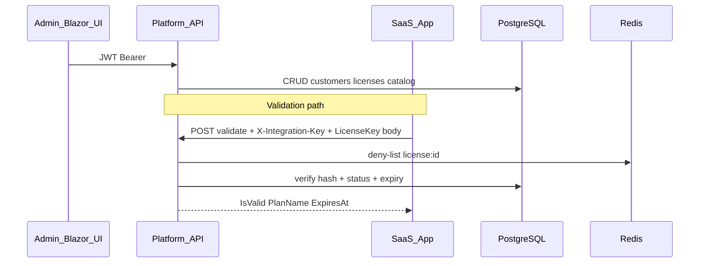

# Platform License Hub

## Vision

Production-ready **centralized admin hub** for the developer/owner to:

1. Register and manage **customer organizations**
2. Define **software services** in a catalog (Hostel, Laundry, School, Asset Management)
3. **Issue, suspend, renew, and revoke** licenses per customer per service
4. **Generate license keys** on activation (cryptographically random), email plain key to customer, store **BCrypt hash only**
5. View a complete **audit trail** of admin actions
6. Expose a **validation API** for owned SaaS apps: `X-Integration-Key` (service identity) + license key in body (customer identity)

**Non-goals:** microservices, over-abstraction, implementing future phases without explicit user go-ahead.

## Technology stack

| Layer | Technology | Status |
|-------|------------|--------|
| Runtime | .NET 9 | Active |
| API | ASP.NET Core Web API, controllers, DI, structured logging | Active |
| Admin UI | Blazor WebAssembly | Scaffolded |
| UI components | **MudBlazor** | Planned (Client) |
| Shared contracts | `Platform.Shared` class library | Enums done; DTOs per phase |
| ORM | EF Core 9 + **Npgsql** | Active |
| Database | **PostgreSQL 16** (Docker) | Active |
| IDs | **NUlid** string primary keys | Active |
| Hashing | **BCrypt.Net-Next** (license + integration keys) | Active |
| Admin auth | **ASP.NET Core Identity** + **JWT Bearer** | **Done** (Phase 2) |
| Service auth | Hashed **integration keys** (`X-Integration-Key`) | Seed done; validation Phase 5 |
| Cache / revocation | **Redis** (`StackExchangeRedis`) | Package referenced; Phase 5 |
| Email | SMTP or **SendGrid** | Phase 4 |
| API docs (dev) | OpenAPI | Active |
| Client HTTP | `HttpClient` + JWT handler | Phase 6 |

## Solution layout

| Folder | Project | Root namespace | Responsibility |
|--------|---------|----------------|----------------|
| `Shared/` | Shared | `Platform.Shared` | DTOs, enums, constants |
| `API/` | API | `Platform.Api` | Entities, DbContext, services, controllers, middleware |
| `Client/` | Client | `Platform.Client` | Blazor WASM, MudBlazor, typed HTTP services |

`Platform.slnx` — keep folder names `API`, `Shared`, `Client`; use `Platform.*` root namespaces only.

## Strict layering

| Type | Location | Never in |
|------|----------|----------|
| Entities | `API/Entities/` | Shared, Client |
| DTOs / request-response | `Shared/` | API entities exposed to client |
| UI / form models | `Client/` | Shared, API |
| Enums | `Shared/Enums/` | — |

## Core entities (exact fields — do not rename)

- **Customer**: Id, Name, ContactEmail, ContactPhone, InternalNotes, IsSuspended, CreatedAt
- **ServiceProduct**: Id, Name, Code, Description, IsAvailableForSale
- **License**: Id, CustomerId, ServiceProductId, Status, ExpiresAt, PlanName, LicenseKeyHash, LicenseKeySentAt, CreatedAt, UpdatedAt
- **AuditLog**: Id, CustomerId?, LicenseId?, InvoiceId?, Action, PerformedBy, DetailsJson, IpAddress, Timestamp
- **IntegrationKey**: Id, ServiceProductId, KeyHash, IsActive, CreatedAt, LastUsedAt
- **Invoice**: Id, CustomerId, LicenseId?, ServiceProductId?, InvoiceNumber, Status, IssueDate, DueDate?, Currency, Subtotal, TaxAmount, TotalAmount, PlanName?, Description?, InternalNotes?, CreatedAt, UpdatedAt
- **Receipt**: Id, InvoiceId, ReceiptNumber, AmountPaid, PaidAt, PaymentMethod, PaymentReference?, Notes?, CreatedAt

ULID IDs: `NUlid.Ulid.NewUlid().ToString()`. Enums → PostgreSQL **strings**.

## Security model (two audiences)



| Secret | Who uses it | Storage |
|--------|-------------|---------|
| Admin credentials | Developer admin UI | Identity tables + JWT |
| Integration key | Each SaaS product (all its customers) | `IntegrationKey.KeyHash`; one active key per `ServiceProduct` |
| License key | End customer in SaaS app | `License.LicenseKeyHash`; plain emailed once on Active |

## EF Core rules

- Configurations: `API/Data/EntityConfigurations/`
- **License** global filter: `!Customer.IsSuspended` — use `.IgnoreQueryFilters()` when admin must see those licenses
- **Invoice** and **Receipt**: same suspended-customer filter via `Customer` / `Invoice.Customer`
- **Customer**: no global filter (must list suspended orgs)
- Migrations: `API/Data/Migrations/`

## Phase delivery rules

1. **One phase at a time** — full code, migrations, config, CLI commands, then stop.
2. **Ask for confirmation** before the next phase.
3. **No placeholders** (`// TODO`, `// add logic here`).
4. External setup (Postgres, Redis, SMTP) → `docker-compose` or clear install notes.
5. See [phases.md](phases.md) for per-phase file targets and acceptance criteria.

### Roadmap summary

| Phase | Focus | Status |
|-------|--------|--------|
| 1 | Entities, DbContext, seed, migrations, Docker Postgres | **Done** |
| 2 | Identity, admin user seed, JWT login, `[Authorize]` admin APIs | **Done** |
| 3b | Invoices, receipts, billing APIs, license activate/renew → invoice | **Done** |
| 3 | Admin CRUD: customers, service catalog, licenses + audit on writes | **Done** |
| 4 | License lifecycle + key generation + email on Active/renew | **Done** |
| 5 | `POST /api/licenses/validate` + Redis deny-list + cache | **Done** |
| 6 | Blazor MudBlazor dashboard (grids, forms, status badges) | **Done** |

## Planned public contracts (not implemented until their phase)

**Validation** — `POST /api/licenses/validate`

- Header: `X-Integration-Key`
- Body: `{ "licenseKey": "...", "serviceCode": "HOSTEL" }` (`serviceCode` optional)
- Response: `{ "isValid": bool, "planName": string, "expiresAt": DateTime? }`

**Redis:** key `license:{licenseId}` for revoked/suspended deny-list; cache valid validation results with TTL.

**License key format:** e.g. `HOSTEL-XXXX-YYYY`; BCrypt hash in DB; email to `Customer.ContactEmail` when status → Active (new or renewed).

**Audit (mandatory when implemented):** every license status change; integration key create/revoke; invoice/receipt events; include `PerformedBy`, `IpAddress`, `DetailsJson`.

### Billing APIs (Phase 3b — implemented)

| Method | Route |
|--------|-------|
| GET | `/api/invoices?customerId=` |
| GET | `/api/invoices/{id}` |
| POST | `/api/invoices` |
| POST | `/api/invoices/{id}/void` |
| POST | `/api/invoices/{invoiceId}/receipts` |
| GET/POST | `/api/licenses`, `/api/licenses/{id}/activate`, `/api/licenses/{id}/renew` |

### Admin domain APIs (Phase 3 — implemented)

| Method | Route |
|--------|-------|
| GET/POST/PUT | `/api/customers`, `/api/customers/{id}`, `/api/customers/{id}/suspend`, `/reactivate` |
| GET/POST/PUT | `/api/serviceproducts`, `/api/serviceproducts/{id}` |
| GET/PUT/POST | `/api/licenses?customerId=&includeSuspendedCustomers=`, `/api/licenses/{id}`, `/suspend`, `/revoke` |
| GET | `/api/audit-logs?customerId=&licenseId=&action=&limit=` |

JWT required (`POST /api/auth/login`). Services: `ICustomerService`, `IServiceProductService`, `IBillingService`, `ILicenseService`, `IAuditLogService`.

Activate/renew license creates a **Sent** invoice automatically.

### License keys & validation (Phase 4–5)

| Method | Route |
|--------|-------|
| POST | `/api/licenses/validate` (header `X-Integration-Key`, no JWT) |
| GET/POST | `/api/integration-keys`, `POST ?serviceProductId=`, `POST {id}/revoke` |

Activate/renew generates BCrypt-hashed license key and emails customer (`Email:Provider` = `Logging` or `Smtp`).

### Blazor admin (Phase 6)

```bash
dotnet run --project Client/Client.csproj   # http://localhost:5154
```

Set `Client/wwwroot/appsettings.json` → `ApiBaseUrl`. Requires API + Postgres (+ Redis for deny-list).

## Local development

```bash
cd "/home/helmut/Documents/My Projects/platform"
docker compose up -d                    # Postgres
dotnet ef database update --project API/API.csproj --startup-project API/API.csproj
dotnet run --project API/API.csproj     # http://localhost:5176
```

Connection: `localhost:5432`, db `platform_db`, user `platform`, password `platform_dev` (see `API/appsettings.json`).

**VS Code PostgreSQL (Microsoft):** `sslmode=disable`; server `localhost` with **no trailing spaces**; not the mssql extension.

**Seeded services:** `HOSTEL`, `LAUNDRY`, `SCHOOL`, `ASSET`. Dev integration keys in `SeedData.DevIntegrationKeys` (Development log only).

## Coding standards

- Nullable reference types, async/await, DI, validation, error handling
- Production-ready but minimal; reuse existing patterns before new abstractions
- MudBlazor: data grids, forms, status badges for license/customer states
- Commits only when user explicitly requests; never commit secrets

## Reference docs

| Doc | Contents |
|-----|----------|
| [phases.md](phases.md) | Full phase scope, folders, acceptance criteria |
| [reference.md](reference.md) | Diagrams, enums, packages, API/UI structure |
| [platform-admin-ui](../platform-admin-ui/SKILL.md) | Dark MudBlazor UI, design tokens, implementation-patterns, screens |
| [implementation-patterns](../platform-admin-ui/implementation-patterns.md) | As-built Client: splash, dialogs, page layout, filters |
| [docs/SaaS-Admin-Hub-UI-Spec.md](../../../docs/SaaS-Admin-Hub-UI-Spec.md) | Downloadable UI/UX specification |
