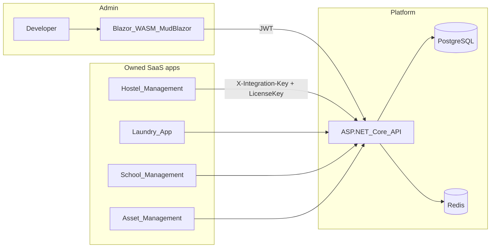
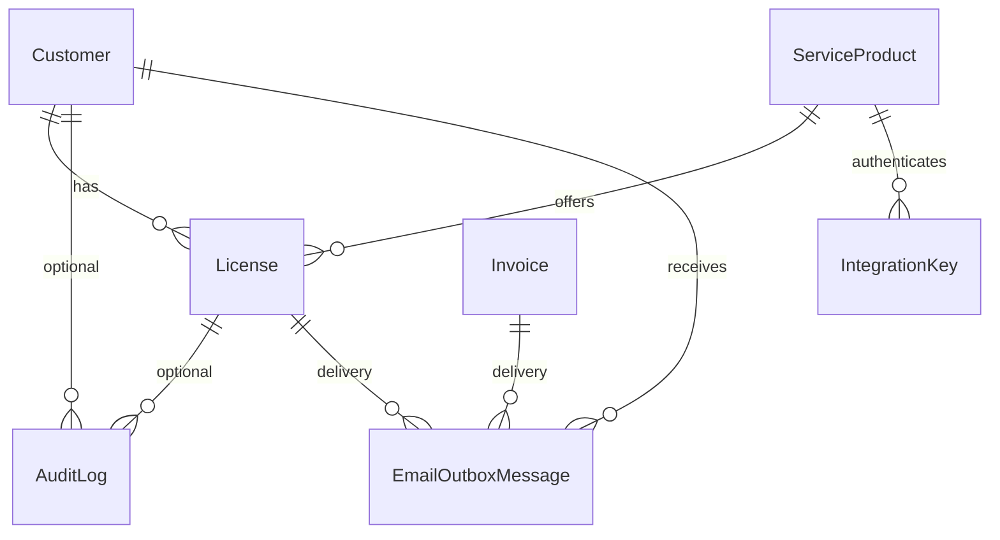
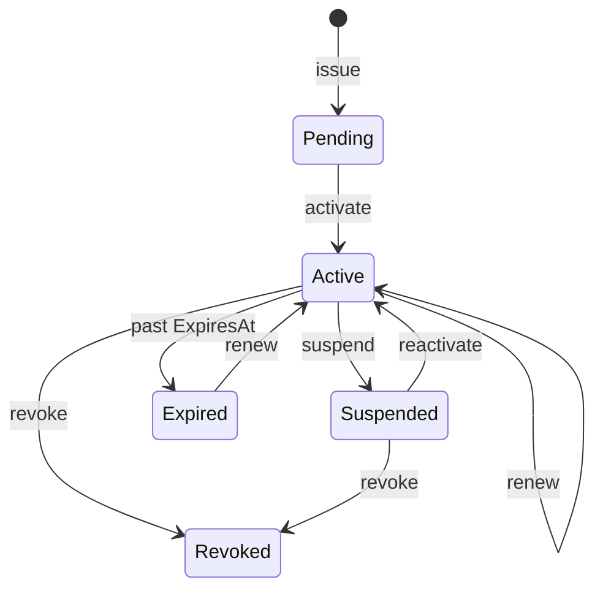

# Platform License Hub — Technical reference

## System context



## Target solution structure (end state)

```
platform/
├── docker-compose.yml          # postgres (+ redis in Phase 5)
├── Platform.slnx
├── Shared/
│   ├── Enums/
│   ├── Dtos/
│   │   ├── Auth/
│   │   ├── Customers/
│   │   ├── Licenses/
│   │   └── Validation/
│   └── Constants/
├── API/
│   ├── Entities/
│   ├── Data/
│   ├── Services/
│   ├── Controllers/
│   ├── Middleware/
│   └── Program.cs
└── Client/
    ├── Pages/
    ├── Components/
    ├── Services/               # Typed HttpClient wrappers
    └── Program.cs
```

## Entity relationships



## Hybrid workflow and delivery

- Customer has primary `ContactEmail` plus optional `TechnicalEmail` and `BillingEmail`.
- License activation, key delivery, invoice creation, and invoice sending are independently selectable.
- Renewal preserves the existing key by default; explicit rotation queues an encrypted replacement.
- `EmailOutboxMessage` stores delivery status and retries. License plaintext is AES-GCM encrypted and wiped after successful send.
- Invoice PDFs are regenerated from `InvoiceId` at dispatch time.
- Expiry reminders and suspend/revoke notices use the same outbox.
- Optional overdue automation suspends only the Active license linked by `Invoice.LicenseId` and records `AutoSuspendedForOverdueInvoiceId`.
- Full payment of clearing overdue invoice(s) can auto-reactivate that license and clear the Redis deny-list.
- Manual payments append `PaymentTransaction` rows; reversals are immutable offsets. Invoice balances derive from the ledger.

## License status lifecycle



## Enums

**LicenseStatus:** `Pending`, `Active`, `Suspended`, `Revoked`, `Expired`

**AuditAction:** `CustomerCreated`, `CustomerUpdated`, `CustomerSuspended`, `CustomerReactivated`, `LicenseIssued`, `LicenseActivated`, `LicenseRenewed`, `LicenseSuspended`, `LicenseRevoked`, `IntegrationKeyCreated`, `IntegrationKeyRevoked`

## NuGet packages

### API (installed)

| Package | Purpose |
|---------|---------|
| `Npgsql.EntityFrameworkCore.PostgreSQL` | PostgreSQL provider |
| `Microsoft.EntityFrameworkCore` + Design | ORM, migrations |
| `NUlid` | Primary keys |
| `BCrypt.Net-Next` | Key hashing |
| `Microsoft.AspNetCore.Authentication.JwtBearer` | Admin JWT |
| `Microsoft.Extensions.Caching.StackExchangeRedis` | Validation cache / deny-list |
| `Microsoft.AspNetCore.OpenApi` | Dev OpenAPI |

### API (Phase 2+)

| Package | Purpose |
|---------|---------|
| `Microsoft.AspNetCore.Identity.EntityFrameworkCore` | Admin users |

### Client (Phase 6)

| Package | Purpose |
|---------|---------|
| `MudBlazor` | UI components |
| `Microsoft.AspNetCore.Components.WebAssembly.Authentication` | Optional auth helpers |
| Project ref → `Shared` | DTOs |

## API surface (planned)

| Method | Route | Auth | Phase |
|--------|-------|------|-------|
| POST | `/api/auth/login` | Anonymous | 2 |
| GET/POST/PUT | `/api/customers/*` | JWT Admin | 3 |
| GET/POST/PUT | `/api/services/*` or `/api/service-products/*` | JWT Admin | 3 |
| GET/POST/PUT | `/api/licenses/*` | JWT Admin | 3–4 |
| POST | `/api/licenses/{id}/suspend` etc. | JWT Admin | 4 |
| POST | `/api/licenses/validate` | `X-Integration-Key` | 5 |
| GET | `/api/audit-logs` | JWT Admin | 3 |

Use consistent route naming once established; prefer controllers + DTOs over exposing entities.

## Validation algorithm (Phase 5)

1. Read `X-Integration-Key` header; reject if missing
2. Find active `IntegrationKey` for product (BCrypt verify against `KeyHash`)
3. Optional: match `serviceCode` to `ServiceProduct.Code`
4. Find `License` by verifying body `licenseKey` against `LicenseKeyHash` (BCrypt)
5. Check Redis `license:{id}` deny-list
6. Validate `Status == Active`, `ExpiresAt` not passed, `!Customer.IsSuspended`
7. Return `{ isValid, planName, expiresAt }`; cache positive result in Redis with TTL

## Email template (Phase 4)

- To: `Customer.ContactEmail`
- Subject: include product name and plan
- Body: plain license key once, expiry date, support note
- Do not BCC or log body in production

## Configuration keys (accumulate by phase)

```json
{
  "ConnectionStrings": { "DefaultConnection": "..." },
  "Jwt": { "Issuer", "Audience", "Key", "ExpiryMinutes" },
  "Email": { "Provider", "SmtpHost", "SmtpPort", "SendGridApiKey", "FromAddress" },
  "Redis": { "ConnectionString" }
}
```

## Docker services

| Service | Image | Port | Phase |
|---------|-------|------|-------|
| postgres | postgres:16-alpine | 5432 | 1 |
| redis | redis:7-alpine | 6379 | 5 |

## MudBlazor UI patterns (Phase 6)

See `.cursor/skills/platform-admin-ui/implementation-patterns.md` for full as-built detail.

- **Pages:** `.page-title` / `.page-subtitle` / `.page-content` in `app.css`
- **Boot:** `.app-splash` logo + green bar in `index.html`
- **Grids:** `MudDataGrid` (customers, licenses, invoices); `MudTable` (services); custom table (audit)
- **Forms:** `MudForm` in `MudDialog`; provider `MaxWidth.Medium`
- **Confirms:** `PlatformDialogOptions.Confirm` on suspend/revoke/delete
- **Filters:** string selects use `"all"` sentinel (customers status/created)
- **Status:** `.status-badge` (customers); `LicenseStatusChip` / license badges (licenses)
- **Mock KPIs:** `.demo-badge` (“Demo data”)
- **Snackbar:** success uses accent styling per design-system (not Mud default green)

## Owned SaaS products (catalog)

| Code | Name |
|------|------|
| HOSTEL | Hostel Management |
| ORDERFLOW | OrderFlow |
| LAUNDRY | Laundry App |
| SCHOOL | School Management |
| ASSET | Asset Management |

## Dev secrets (Development only)

Integration keys: `API/Data/SeedData.DevIntegrationKeys` — logged at startup, never in git for production.

## Commit conventions

- Commit only when user asks
- Never commit `.env`, JWT keys, SMTP/SendGrid keys, plain license or integration keys
